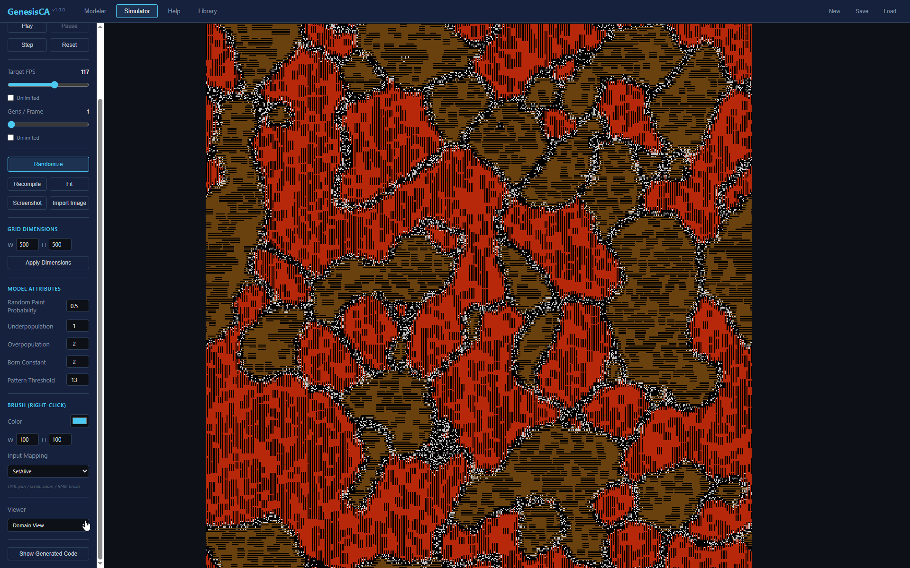

# GenesisCA <sup>v1.0.0</sup>

An IDE for modeling and simulating Cellular Automata, built as a self-contained browser application.

**[Launch GenesisCA](https://rff255.github.io/GenesisCA/)** — runs entirely in your browser, no installation required.

---

## What GenesisCA Is

GenesisCA is an IDE for modeling and simulating Cellular Automata (CA). It uses a Visual Programming Language (VPL) — a node-based graph editor — so users can design arbitrarily complex CA models without writing code. The goals are **accessibility** (no programming required) and **performance** (grids up to 5000x5000+).

Everything runs 100% client-side — no server, no sign-up, no paid hosting.

Originally created as an undergraduate final project at the Universidade Federal de Pernambuco (UFPE, Brazil) in 2017, the application has been completely rewritten as a modern web application.

---

## The GenesisCA Model Definition

### Six Fundamentals

Every GenesisCA model satisfies these theoretical properties:

1. Cells have unlimited computing power
2. Cells have N internal attributes (of multiple data types), whose snapshot of values at a given generation is called its "state"
3. Cells are limited to only access (read) the states of cells in one of the neighborhoods defined in the CA model
4. Cells can only make changes to themselves, never to the environment around (other cells)
5. Space and Time are discrete (cells arranged in n-dimensional grid)
6. All cells update their states simultaneously (synchronously) each passing generation

### Simulation Essentials (Color Mappings)

Beyond the six fundamentals, two types of mappings enable visualization and interaction:

1. **Attribute-Color Mappings** — N ways to map cell state → colors (for visualization)
2. **Color-Attribute Mappings** — N ways to map colors → cell state (for user interaction and image-based initialization)

### Model Structure

A complete GenesisCA model definition consists of:

1. **Model Properties**
   - 1.1. Presentation (Name, Author, Goal, Description, Tags)
   - 1.2. Structure (Topology, Boundary Treatment, Grid Size)

2. **Attributes** — each has a name, type (bool, integer, float), description, and a default value
   - 2.1. Cell Attributes (per-cell state)
   - 2.2. Model Attributes (global parameters that all cells can read but not write; adjustable at runtime in the Simulator)

3. **Neighborhoods** — a list of neighborhoods, each being a list of relative offsets from the central cell (margin up to 20)

4. **Color Mappings** — each mapping has a Name, Description, per-channel descriptions (R, G, B)
   - 4.1. Color-Attribute Mappings (input: for initialization, brush tool, and image import)
   - 4.2. Attribute-Color Mappings (output: for visualization modes)

5. **Update Rules** — a node graph defining what each cell computes per generation, compiled into optimized JavaScript at edit time

---

## Features

### The Modeler
- **Properties Panel** — model metadata, grid dimensions, boundary treatment (torus/constant), tags
- **Attributes Panel** — cell and model attributes with type-specific default value controls
- **Neighborhoods Panel** — interactive grid editor for defining spatial neighborhoods
- **Mappings Panel** — Attribute-to-Color and Color-to-Attribute mapping definitions
- **Graph Editor** — 21 node types across 6 categories (flow, data, logic, aggregation, output, color), with RMB pan, scroll zoom, and snap-to-grid
- **Inline Port Widgets** — input ports show small value editors (number/bool) when unconnected, eliminating the need for constant nodes in simple cases
- **Node Collapse/Expand** — double-click any node to collapse it; constants show their value; collapsed nodes temporarily expand when connecting edges
- **Color Pickers** — Color Constant and Set Color Viewer nodes include hex color pickers with per-channel R/G/B controls
- **Macro System** — encapsulate node groups into reusable subgraphs with MacroInput/MacroOutput boundary nodes
- **Copy/Paste/Duplicate** — Ctrl+C/V/X/D, context menu on single nodes and selections, paste at right-click location
- **Groups & Comments** — visual organization tools; Undo Group dissolves a group and selects all contained nodes

### The Simulator
- **Play/Pause/Step/Reset** with FPS and Gens/Frame sliders (+ unlimited modes)
- **Zoom/Pan** (scroll + LMB drag) and **Brush tool** (RMB)
- **Live model attribute controls** — change global parameters without recompiling
- **Grid dimension overrides** — experiment with different sizes
- **PNG screenshot export** — pixel-perfect grid capture
- **Image import** — load PNG/BMP/JPG as starting point (1 pixel = 1 cell)
- **Viewer selector** — switch between color mappings

### Help & Library
- **Comprehensive Help tab** — 8 sections covering all features with sidebar navigation
- **Models Library** — pre-made models loaded from the repository, no manual index required
- **First launch** — automatically loads Game of Life as a demo; "New" creates a blank model
- **GitHub link** — accessible from the navbar and Help page

---

## Screenshots

**Modeler** — Visual programming graph editor with node-based update rules:


**Simulator** — Real-time grid visualization with zoom, pan, and brush tools:


**Models Library** — Pre-made models to explore and learn from:


**Other Images**


---

## Getting Started (if you want to contribute, fork or run the code locally)

### Prerequisites

- [Node.js](https://nodejs.org/) 18+ (22 LTS recommended)
- npm 9+ (comes with Node.js)

### Setup

```bash
git clone https://github.com/rff255/GenesisCA.git
cd GenesisCA
npm install
npm run dev
```

The app opens at **http://localhost:5173**.

### Available Scripts

| Command | What it does |
|---------|--------------|
| `npm run dev` | Start development server with hot reload |
| `npm run build` | Type-check and build for production |
| `npm run preview` | Preview the production build locally |

### Tech Stack

- **TypeScript + React** — UI framework
- **Vite** — build tool and dev server
- **React Flow** — node-based graph editor
- **Canvas2D** — grid rendering
- **Web Workers** — off-thread simulation engine
- **CSS Modules** — scoped component styling

---

## License

This project is licensed under the **GNU General Public License v3.0** — see the [LICENSE](LICENSE) file for details.
