# GenesisCA <sup>v1.29.0</sup>

An IDE for modeling and simulating Cellular Automata, built as a self-contained browser application.

**[Launch GenesisCA](https://genesisca.online)** — runs entirely in your browser, no installation required.

---

## What GenesisCA Is

GenesisCA is an IDE for modeling and simulating Cellular Automata (CA). It uses a Visual Programming Language (VPL) — a node-based graph editor — so users can design arbitrarily complex CA models without writing code. The goals are **accessibility** (no programming required) and **performance** (compiles WASM and even WebGPU for synchronous models).

> Everything runs 100% client-side — no server, no sign-up, no paid hosting.

Originally implemented in C++/Qt/DearImgui as an undergraduate final project at the Universidade Federal de Pernambuco (UFPE, Brazil) in 2017 (See historical branch `legacy_qt_cpp_solution`), the application has been completely rewritten as the free modern web application it is today.

---

## Overview

### **Modeler**
Visual programming graph editor with node-based update rules, and panel with total freedom to define any and how many cell attributes; neighborhoods; and mappings to/from colors from/to cell attributes:
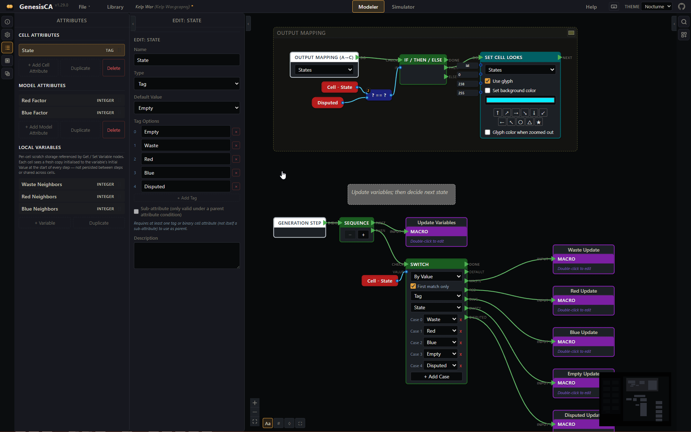

### **Simulator**
Real-time visualization with parameter controls; cell inspector; copy/paste selection; brush/image input; enabling saving of full grid state; recording gifs/videos; and taking screenshots:
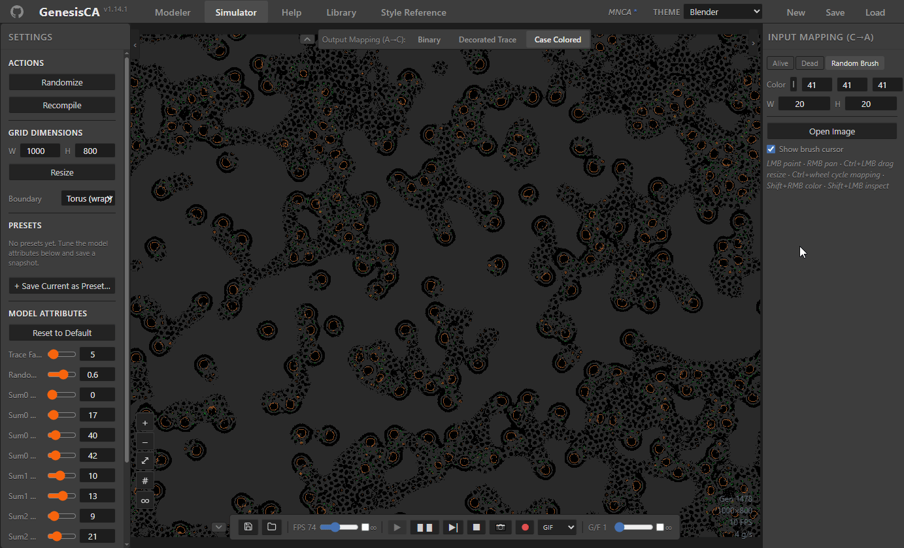

### **Models Library**
Pre-made models to explore and learn from. Enabling users to build upon classical or innovative models:
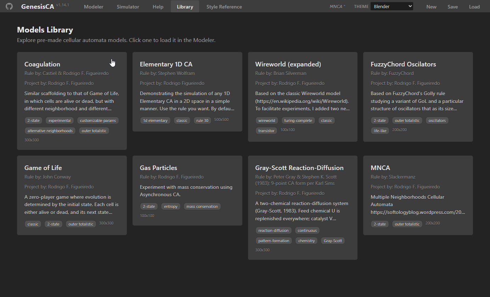

### **In-app Help**
Detailed in-app help tab with a comprehensive tutorial and reference material regarding features, usage, shortcuts and such. Press **?** anywhere (or the navbar keyboard-shortcuts button) for a quick on-screen shortcuts cheat sheet, and **F** (or the **⛶** button on the canvas) to maximize the canvas. A navbar **Theme** switcher offers two dark themes (**Blender** and **Nocturne**):
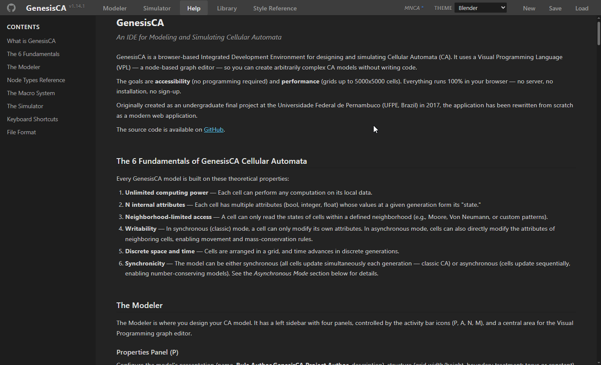

### **Install & Offline**
GenesisCA is an installable [Progressive Web App](https://web.dev/explore/progressive-web-apps). Open it in Chrome or Edge and use the navbar **⤓ Install** button (or the browser's own install affordance) to add it as a standalone desktop app — its own window and icon (no tabs or address bar) — that **runs fully offline**: the app, the Models Library, previews, and your work are served from a local cache. A standalone portable **`GenesisCA.exe`** — a [Tauri](https://tauri.app) shell wrapping the same build — is published to the [Releases](https://github.com/rff255/GenesisCA/releases/latest) page: download and run it directly, no install (it runs from anywhere, e.g. a USB stick).

### **Example**
Gray-Scott Reaction-Diffusion model `[Peter Gray & Stephen K. Scott (1983)]`:
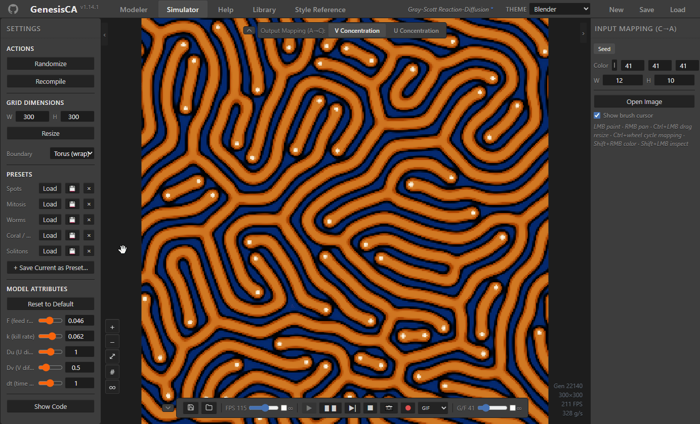

**Other**

<table>
  <tr>
    <td align="center" width="25%">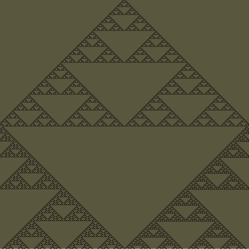<br/><sub>1D Elementary CA — Rule 90</sub></td>
    <td align="center" width="25%">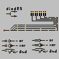<br/><sub>Wireworld (expanded)</sub></td>
    <td align="center" width="25%">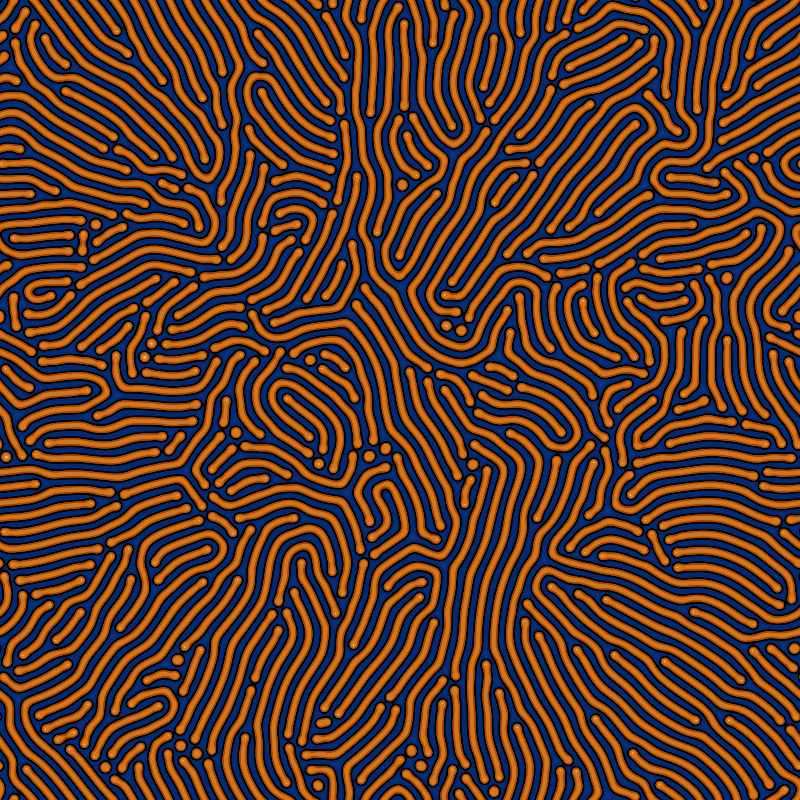<br/><sub>Gray-Scott (still)</sub></td>
  </tr>
  <tr>
    <td align="center" width="25%">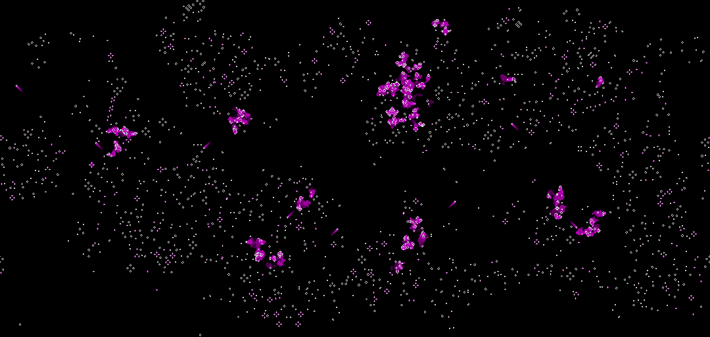<br/><sub>Game of Life</sub></td>
    <td align="center" width="25%">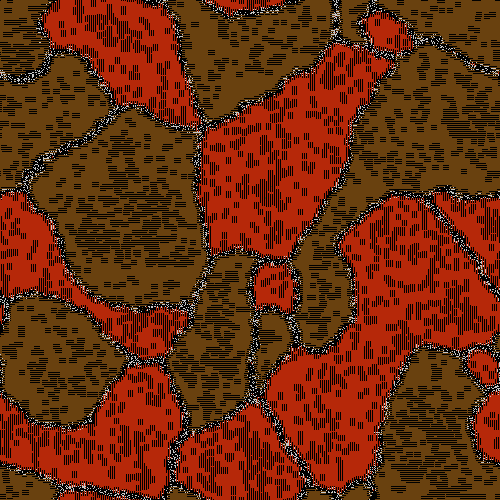<br/><sub>Coagulation</sub></td>
    <td align="center" width="25%">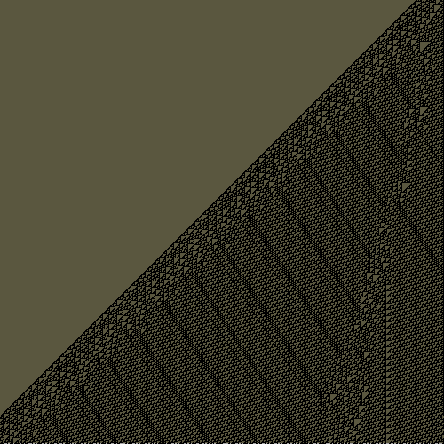<br/><sub>1D Elementary CA — Rule 110</sub></td>
  </tr>
</table>

---

## The GenesisCA Model Definition

### Six Fundamentals

Every GenesisCA model satisfies these theoretical properties:

1. Cells have unlimited computing power
2. Cells have N internal attributes (of multiple data types), whose snapshot of values at a given generation is called its "state"
3. Cells are limited to only access (read) the states of cells in one of the neighborhoods defined in the CA model
4. **Writability** — In synchronous (classic) mode, cells can only modify their own attributes. In asynchronous mode, cells can also directly modify the attributes of neighboring cells, enabling movement and mass-conservation rules.
5. Space and Time are discrete (cells arranged in n-dimensional grid)
6. **Synchronicity** — Model can be either synchronous (all cells update simultaneously — classic CA) or asynchronous (cells update sequentially, enabling number-conserving models)

### Simulation Essentials (Color Mappings)

Beyond the six fundamentals, two types of mappings enable visualization and interaction:

1. **Attribute-Color Mappings** — N ways to map cell state → colors (for visualization)
2. **Color-Attribute Mappings** — N ways to map colors → cell state (for user interaction and image-based initialization)

### Model Structure

A complete GenesisCA model definition consists of:

1. **Model Properties**
   - 1.1. Presentation (Name, Rule Author, GenesisCA Project Author, Description, Tags)
   - 1.2. Structure (Topology, Boundary Treatment, Grid Size)
   - 1.3. Execution (Update Mode, optional End Conditions: max generations + indicator rules)

2. **Attributes** — each has a name, type (binary, integer, decimal, tag, vector, color, NeighborIndex), description, and a default value
   - 2.1. Cell Attributes (per-cell state) — including NeighborIndex for cells that point at one of their neighbors (movement direction, leader-follower, etc.) and **Vector** (a stored 2D/3D direction — a flow field, a facing, an accumulated force — read/written as one value via Make/Break Vector, and available for agent attributes and Local Variables too). Cell attributes can also be marked as **sub-attributes** — only well-defined when a parent (Tag or Binary) cell attribute is in a chosen value set, e.g. *charge* defined only on Wire (wireworld model). The compiler auto-injects parent-check guards at every read site so rules express "count head-charges around me" directly, with no manual filter-by-type chains
   - 2.2. Model Attributes (global parameters that all cells can read but not write; adjustable at runtime in the Simulator)

3. **Neighborhoods** — a list of neighborhoods, each being a list of relative offsets from the central cell (margin up to 20), optionally including the central cell (`[0,0]`) itself

4. **Color Mappings** — each mapping has a Name, Description, per-channel descriptions (R, G, B)
   - 4.1. Color-Attribute Mappings (input: for initialization, brush tool, and image import)
   - 4.2. Attribute-Color Mappings (output: for visualization modes)

5. **Indicators** — quantitative monitoring variables, either standalone (read/write from graph) or linked to cell attributes (auto-computed aggregations: frequency, total)

6. **Update Rules** — a node graph defining what each cell computes per generation, compiled at edit time to one of three targets: WebAssembly (default), WebGPU, or JavaScript (debug / reference). All three compilers apply *value sinking* — value computations that are only consumed inside a specific switch case or if branch are emitted *inside* that branch rather than always at cell-top, so on type-dispatch models (Wireworld, etc.) the dominant cell type pays only for the work its branch actually needs.

---

## Features

### The Modeler
- **Info Panel** — model presentation metadata: Name, Rule Author, GenesisCA Project Author, a short **Summary** (the blurb shown on the model's Models Library card) and a longer free-form **Rule Description** (elaborate on how the rule works — not shown on cards), tags, and an optional **Thumbnail** (PNG/JPEG/GIF/WebP up to 2 MB — shown on hover in the Models Library)
- **Properties Panel** — grid dimensions, a **Dimension** radio (2D / 3D — 3D adds a Grid Depth field and makes the lattice a `W×H×D` volume), boundary treatment (torus/constant), update mode (synchronous/asynchronous), optional End Conditions (max generations + indicator-based auto-pause rules), and the Indicators list. A **Topology** group (Grid Cells / Bond-Graph Agents — see *Bond-Graph Agents* below) sits in Execution, with a *Bond-Graph Agents* config block when Agents is enabled.
- **Attributes Panel** — cell and model attributes with type-specific default value controls (binary, integer, decimal, tag, color, NeighborIndex); cell attributes gain an optional **Boundary Value** field when boundary is set to constant. NeighborIndex attributes show a clickable cell-grid editor anchored to a chosen *hint neighborhood* for picking the default slot. Selecting an item (a Cell/Model attribute or a Local Variable) opens its editor in a **second side panel** beside the list (the same master-detail layout is used by the Neighborhoods and Mappings panels) so you never scroll past a long list to reach the fields you're editing. A **Duplicate** button clones the selected attribute, variable, output mapping (cell or agent), or **indicator** with a fresh id — like the Neighborhoods duplicate.
- **Neighborhoods Panel** — interactive grid editor with per-neighborhood margin, optional per-cell tags for named access, click the centre cell to include it (`[0,0]`) in the neighborhood, and a Duplicate button for quick variations. **Drawing tools** (Point / Circle / Ring / Line) make MNCA-scale neighborhoods quick: Circle edits a filled disc from a center + edge click, Ring the band between an inner and outer radius (3 clicks), Line every cell between two endpoints. A **Mark / Unmark / Toggle** mode picks what an edit does to covered cells, and independent **symmetry toggles** (horizontal / vertical / main-diagonal / anti-diagonal — any three = full 8-fold) mirror every edit so you only draw one octant. The live hover preview is color-coded by outcome (will-activate / will-deactivate / unchanged), readable over both filled and empty cells
- **Mappings Panel** — Attribute-to-Color and Color-to-Attribute mapping definitions. Output (A→C) mappings can be **Standalone** (build the color graph by hand) or **Linked** — pick a cell attribute and GenesisCA auto-generates the color pass (binary → two-color; decimal/integer → a color scale spanning a user-set min/max, chosen from palette presets like Viridis/Magma/Rainbow or customized stop-by-stop with the same gradient editor as the Color Scale node; tag → one distinct color per option), all fully recolorable. A Linked mapping still works if you also drop its Output Mapping node into the graph: the auto pass runs first as a background and your graph overrides whichever cells it paints (special colors, glyphs, …). Lockstepped across the JS, WASM, and WebGPU compilers. The **Set Cell Looks** node can also target **Current Simulator Selected** instead of a fixed mapping — writing to whichever viewer is active — so one color pass can be reused across several viewers that differ only in other respects.
- **Indicators** — defined in the Properties panel; click one in the list to edit it in a **second side panel** beside the list (the same master-detail layout as Attributes/Neighborhoods/Mappings). Standalone (typed scalar, graph-writable) or linked (auto-aggregated from cell attributes: frequency, total), with per-generation or accumulated modes. Frequency indicators can be viewed as horizontal bars, multi-line time series, or stacked-area time series (viz button cycles the three; preference persists per indicator). In the Lines/Stack and spatial (chromatogram) views, **click a legend entry** to hide that series (click again to show it) — a per-session view toggle, separate from Track Categories. Each chart has a **gear popover** for fixed Y min/max (blank = dynamic), Y tick count, a time-axis **Window** (show only the most-recent N generations — blank = all history), and per-series colors — set model-level defaults in the Modeler (they travel in the `.gcaproj`), tweak per-user overrides in the Simulator (persisted locally and saved with the project when "Simulator controls" is ticked). A per-chart **Clear** button (`⌫`) wipes the accumulated history so you can start monitoring afresh (e.g. after a reset). Linked indicators can also switch their **X-axis** from Generation to **Rows/Columns**, turning into a live **spatial histogram (chromatogram)** — one curve per series plotted against grid position, with selectable slice- or absolute-binning (reproduces the population-vs-position plots common in chemistry CA papers). Binary/Tag frequency indicators add a **Track Categories** checklist &mdash; chart only a chosen subset of category values so a dominant one doesn't flatten the rest on the shared Y-axis (e.g. a cell-type chromatogram can show just the two solutes and ignore the solvent); each series keeps its own stable color as you toggle which categories are tracked. End Conditions accept per-category comparisons on frequency indicators (e.g. pause when count of `alive` cells &ge; 100).
- **Local Variables** — per-cell mutable scratch storage referenced by name across the graph (defined in the Attributes panel's Local Variables section; the editor opens in the shared detail panel). Lets you write rules as imperative pseudocode ("for each direction `d`, set `weights[d] = compute(d)`; then sample by weights") instead of unrolled dataflow. Scalar or fixed-length array; reset to an initial value at the start of every cell's computation. Nodes: Get Variable / Set Variable / Set Array Element, paired with For Each In Array's Index output. Runs on all three compile targets.
- **Graph Editor** — over 100 node types across 7 categories (event, flow, data, logic, aggregation, output, color — indicator readers/writers live within data/output), with RMB pan, scroll zoom, and snap-to-grid. The palette only shows nodes available for your model — async-only, Variegated-Cells, and Bond-Graph-Agent nodes appear once you enable those features. Includes Switch (flow routing by conditions or value), For Each In Array (iterate any typed array, exposing the per-iteration Element **and** Index), an **Expression** node (type a math formula — `+ - * / % ^`, `sqrt abs floor ceil round min max pow mod exp log sin cos tan tanh` — instead of wiring up many Math nodes, ideal for equation-heavy models), **Value Switch** (a pure-value ternary — pick between two values without forking the flow; also relays arrays, so you can select between two neighbour sets and feed the result straight into Pick Random Neighbor), **Get Grid Dimensions** (the world's Width / Height / Depth, plus optional Center X/Y/Z = ⌊size/2⌋ outputs — available on the Cells *and* Agents graphs, so a rule can be written independently of the grid size: seed the middle, normalise a coordinate, fade by distance from an edge — instead of hard-coding numbers that go silently wrong on the next resize), Get Random (random binary/integer/decimal, or pick uniformly from an Options array), Proportion Map and Color Scale (multi-stop gradient with selectable curves: Linear, Smoothstep, Ease-In/Out Quadratic, Exponential, Logarithmic, plus one-click palette presets like Viridis/Magma/Rainbow), **Categorical Color** (map an integer index to a flat palette color — discrete, no blending), Interpolation, Aggregate / Group Reduce (multi-input math + median, weighted-random sampling), neighborhood tag-based access nodes, NeighborIndex bootstrap (Get All Neighbor Indexes), constructors, Flip, Pick Random Neighbor / Pick N Random Neighbors, generic Get Array Element / Array Length, and a **Stop Event** node that pauses the simulator with a user-defined message when its flow input fires.
- **Multi-attribute slots** — the Get/Set Attribute accessors (own cell/agent, Model Attribute, and the by-id Get/Set Agent Attribute) take a dynamic number of attribute **slots** ("+ Attribute"): one Get node reads several attributes through per-slot output ports, one Set node writes several in slot order, each slot with its own type-adaptive inline widget (the by-id pair shares its single Agent input across all slots). Collapses the "one node + one wire per attribute" clutter; compiles to exactly the same code as the equivalent hand-built chain, on all three targets (cell and agent graphs, 2D and 3D)
- **Flow chaining (NEXT / DONE)** — every action node has a pass-through **NEXT** flow output and every flow-control node a **DONE** (completed) output, so executions chain UE-Blueprints-style (`Set A → Set B → Set C`) instead of fanning wires out of one DO port or inserting Sequence nodes. Zero runtime cost — chains compile to exactly the same code as the equivalent fan-out, on all three targets
- **Connection validation** — prevents incompatible connections (flow/value), cycles, and duplicate inputs; compatible ports highlight during drag
- **Inline Port Widgets** — input ports show small value editors (number/binary) when unconnected, eliminating the need for constant nodes in simple cases
- **Node Collapse/Expand** — double-click any node to collapse it; constants show their value; collapsed nodes temporarily expand when connecting edges. A collapsed node still **fans its connected ports out** (at a tight spacing) so you can tell which wire goes where without expanding it
- **Palette** — right-side panel with a drag-and-drop list of every node type (grouped by category), default macros shipped with the app (from `public/macros/*.gcamacro`), and the current project's macros. Splits vertically into independently-scrolling **Nodes** and **Macros** sections with a draggable horizontal splitter; a **List / Visual** toggle switches between a compact text list and mini node-preview cards (split position and view mode persist across sessions)
- **Quick-add node menu** — press `Space` over the canvas (or right-click blank canvas) to open a focused add-node menu right at the cursor: the usual actions (Paste / Add Comment / Add Group / Import Macro…) on top, then a search field and a category-grouped node list. Type to filter, `↑`/`↓` to move the always-present highlight (defaults to the best name match), `Enter` to add the highlighted node where the cursor was, `Esc` to dismiss. It's the same searchable list you get when you drag a wire onto empty canvas
- **Searchable connection-drop menu** — drag a wire off any port and release on empty canvas to get a searchable list of compatible nodes: type keywords to filter, `↑`/`↓` to move the highlight, `Enter` to add the node at the release point and auto-wire it (same keyboard flow as quick-add). Dragging from an output also offers Reroute
- **Node Explorer** — searchable right-side panel (Ctrl+F to open, Esc to close) listing all placed nodes with click-to-focus
- **Incomplete-config warnings** — nodes with unset required parameters (e.g., an unselected attribute/neighborhood/mapping) show an amber warning badge in the header so you can spot them at a glance. Macro instances bubble up internal-node warnings (recursively through nested macros), so misconfigured internals are visible without opening the macro
- **Macro System** — encapsulate node groups into reusable subgraphs with MacroInput/MacroOutput boundary nodes. Reuse a macro as a **linked** (mirror) copy that shares one definition — editing any instance's internals updates all of them — or as an **independent** copy with its own definition. Drag from the Palette's Project Macros or right-click → **Duplicate → Duplicate Linked** to make a linked copy; **Duplicate → Duplicate Independent** (or copy/paste) makes an independent one. When 2+ instances share a definition, a small **count badge** (Blender-style) appears at the left of each Macro node's header; click it and choose **Make Independent Copy** to break the link for that instance
- **Align while dragging** — hold **Ctrl** (or Cmd) while moving any node, comment, or group and it snaps so its edges/center line up with nearby nodes, showing dashed guide lines (PowerPoint-style). Works for single nodes, multi-selections (the selection's outer box aligns), and groups; overrides snap-to-grid while held
- **Undo/Redo** (partial) — Ctrl+Z / Ctrl+Shift+Z (Ctrl+Y) for node/edge operations, moves, paste, config changes
- **Copy/Paste/Duplicate** — Ctrl+C/V/X/D, context menu on single nodes and selections, paste at right-click location
- **Groups & Comments** — visual organization tools; comment background color is customizable and the resized size persists; Undo Group dissolves a group and selects all contained nodes. Drag a group's **header** to move it, drag its **body** to box-select inner nodes (Shift adds / Ctrl removes from the selection), click the body to select the group, and right-click-drag to pan; double-click the header to rename. A selected group **stays behind** its contained nodes (it no longer pops to the front), so you can keep clicking the nodes and links inside it
- **Reroute points** — bend wires and fan one output out to many places without long crossing links. **Press and hold** the left mouse button on a wire (~½ s) to drop a reroute that then follows your cursor; once placed it's an ordinary node — drag it to move it (and it moves with a multi-selection). A reroute always relays an **output** (one input, any number of outputs), and reroutes can be chained. They're purely cosmetic — a wire through a reroute compiles identically to a direct connection — and deleting one removes it and all its links
- **Interactive minimap** — the overview map (bottom-right) is pannable and zoomable, and a click jumps the viewport to that spot (keeping the current zoom)

### Variegated Cells (Directional Interactions) &mdash; opt-in
- **Per-cell orientation** — 0&ndash;3 = 0/90/180/270&deg; clockwise rotation, auto-allocated when the feature is on. Defaults to 0; set via the new `Set Orientation` node (typical pattern: an `Init Event` runs once on Reset, picks a random rotation per cell).
- **Face-label Palettes & Face Patterns** — define one or more named face-label **palettes** (independent label sets, e.g. analyte faces vs. stationary-phase faces). A **face pattern** is a named 8-slot layout (N/NE/E/SE/S/SW/W/NW; edges-only mode disables the four corners) that draws its labels from one palette. Assign a pattern to each tag option in the Attributes panel; the implicit `none` label covers unassigned slots and non-variegated neighbors.
- **`Lookup Table` model attribute** — a (possibly **rectangular**) matrix with an independent **row key source** and **column key source**, each either **Custom labels** (an arbitrary set of row/column names you add/remove/rename right on the definition page — not tied to any attribute), a face-label palette (`['none', ...labels]`), a tag attribute (its options — e.g. empty/water/amphi), or **Single value (map)** — a one-element axis that collapses the table into a 1-D **map** keyed only by the other axis (no throwaway single-option tag attribute needed). The cell **value type** is selectable (Binary / Integer / Decimal / Tag — Decimal by default) with a type-appropriate per-cell editor (Binary is a checkbox); a Tag value type takes its labels either from a manual list or from an existing tag attribute. A pure tag×tag table needs no faces, so it works even with Variegated Cells off. Edit in the Attributes panel; live-tune in the Simulator like any other model attribute. Ships a **General 2D CA (Golly style)** sample — a generalized Life-like Born/Survive rule whose entire rule table is one Lookup Table with custom `0-8`×`Born/Survive` labels and a **Binary** value type (no helper attributes, no decimal placeholders), with 12 classic rules (Conway, Replicator, Diamoeba, Anneal, Morley, …) as presets.
- **Multi-axis (N-D) Lookup Tables + seeded Randomize** — a table can have **up to 6 axes** (not just rows × columns), with a new **Integer range** axis kind for count-indexed rules. The Table Lookup node shows one input per axis; the editor shows the table as 2-D slices with steppers for the outer axes. A **Randomize** block fills the whole table from a **seed** at a chosen density — the seed *is* the rule identity (same seed ⇒ same structure), so re-roll it to grow a different form. Ships the **Accretor** sample (Driessens & Verstappen) — a 3D accretion automaton on a **300³ grid (27M cells)** whose rule is a 4-axis table indexed by `state × face × edge × corner` neighbour counts: from a small central seed the structure accretes outward (two species) until it reaches a grid edge, then a Stop Event pauses it. The seed placement and edge detection are **grid-volume-independent** (computed from the live grid dimensions), so resizing the grid re-centres them. A once-run **Grid Init Event** scatters the random central seed; a **`symmetricSeed` model attribute** toggles between an asymmetric seed and a mirror-symmetric one — flip it and Reset to grow a perfectly octahedrally-symmetric structure. Either way the seed is **random and re-rolls on every Reset** ("symmetric seeds produce symmetric structures"). Runs on JS, WASM, and WebGPU. The 27M-cell volume is practical because the model ships with **Skip Isolated Empty Cells** on (see below). Its **Experiments panel** ships a **Rule Explorer** — an Overseer experiment that sweeps a list of seeds, re-rolls the rule table for each, runs it to the edge, and charts how big each rule's structure grows (the automated version of re-rolling until something interesting appears).
- **Particle Life (2D + 3D samples) + matrix-play editing** — the classic Particle Life sandbox on the agent platform: K species (an agent tag attribute) with THREE asymmetric species×species Lookup Tables — the signed **rules** matrix (attract/repel ∈ −1…1) plus **per-pair min/max radii** — driving the repel-core + tent pairwise force, with live sliders (N / forceFactor / repel / friction / queryRadius) and named matrix presets (snake, rock–paper–scissors, symmetric clusters). Decimal-valued tables open in a **Matrix view** built for play: diverging colour cells (red = repel, cyan = attract), drag-a-cell to adjust, multi-select + a shared slider, seeded signed **Randomize (Min…Max)**, a generator menu (their full pattern catalogue) and Zero/Symmetrize/Transpose/Negate/Mutate quick actions — all live while the simulation runs. Runs on JS, WASM (bit-parity) and WebGPU.
- **New nodes** — `Get/Set Orientation`, `Get Facing Orientation`, `Get Neighbor Orientation By Index`, `Set Facing Orientation` / `Set Neighbor Orientation By Index` (async-only), `Get Facing Labels` / `Get All Facing Labels` (resolve the face labels touching at an encounter, accounting for both cells&apos; orientations and patterns), `Table Lookup` / `Table Map` (index a Lookup Table by a row and column index — works with or without Variegated Cells), and `Transfer Cell Attributes to Neighbor` (copy/move/swap cell attributes &amp; orientation between this cell and a neighbour; async-only). Fully supported on JS, WASM, and WebGPU — except the async-only nodes (the two orientation writers + `Transfer Cell Attributes to Neighbor`), which are unavailable on WebGPU (synchronous-only).
- **`Init Event` Node** — entry-point that runs once per cell on simulator Reset (after defaults, before the first color pass). Outputs `x`, `y`, `maxX`, `maxY` and triggers a DO flow chain. Useful for any model that wants procedural initial state, not just variegated ones.
- **`Grid Init Event` Node** — the *global*, free-form counterpart to the per-cell Init Event (mirroring the Agent Init Event): it runs **once** on Reset, so you can **loop and write arbitrary cells** with the new **Set Cell (at Position)** node — imperative seeding the per-cell version can't express (place N random seeds, draw a line/shape, seed the middle box). Outputs the grid `width` / `height` / `depth` (so seeding is grid-size-independent — seed the middle at `width/2`). Runs on JS, WASM, and WebGPU.
- **Unlocks chemistry CA models** — water-aabb (H/LP face patterns + interaction matrix), amphiphile micelle formation, chiral chromatographic separation, structured solvent dynamics. References: Kier, Seybold &amp; Cheng (2005), Kier et al. (2000), DeSoi et al. (2013).
- **Ships as working samples** — the **Amphiphile** model implements the Kier book's move-into-empty micelle-formation rule end-to-end (Variegated Cells + Local Variables + chemistry primitives), with 9 interaction-table presets (the book's defaults plus the 8 Kier 1996 parameter sets). The **Chromatography** model (Kier, Cheng &amp; Karnes 2000) reproduces a packed-column separation of two solutes on a 43&times;200 async grid &mdash; a recirculating cylinder (a full torus: the gravity-driven mobile phase exits the bottom and flows back to the top, so it never just drains) where type&times;type **PB**/**J** Lookup Tables drive breaking/joining, a single gravity term pushes the mobile phase down the column, and a spatial **chromatogram** indicator plots solute population vs. column position (the paper's Figure 3). A detector line (a &ldquo;monitor&rdquo; cell flag on the bottom row) fires a **Stop Event** the moment the leading solute elutes &mdash; an event-driven analog of the paper&rsquo;s fixed-iteration snapshot. 17 presets span the paper's affinity, flow-rate, solvent-polarity and solvation studies.

### 3D Grid CA &mdash; opt-in
- **Volume lattice** — flip **Dimension** to **3D** in Properties to make the grid a `W×H×D` volume. The engine is dimension-agnostic (`total = W*H*D`, a 3-tuple neighbour-offset table, a per-cell layer decode) and runs on **all three compile targets** (JS / WASM / WebGPU) — a 2D model compiles byte-identically. Ships a **Life3D** sample (Carter Bays' 5766 rule on a 24³ torus).
- **3D neighbourhoods** — the Neighborhoods panel swaps the flat grid for a **parametric** builder (Moore / von Neumann / Ball / Range-N / Shell / Ring / Disk, with an L∞/L1/L2 metric) plus a **slice-stack editor** (step through Z layers, toggle cells, three axis-plane mirrors, per-cell tags) and a live orbiting **3D preview**.
- **3D NeighborIndex offsets** — the whole NeighborIndex node family works in 3D: the packed codec is dimension-aware (2D `(dr, dc)`; 3D `(dr, dc, dl)`), and *Neighbor Index (from Offset)* / *Break Down Neighbor Index* gain a `dl` (layer) port in 3D.
- **WebGL2 voxel renderer** — the simulator renders 3D models as instanced cubes (only live, non-transparent cells are drawn): **orbit** the camera (Blender-style, Z-up: middle-drag / Alt+drag / right-drag, wheel zoom, Shift to pan), click the **corner gizmo**'s axis tips to snap to a view (the gizmo is depth-sorted and labelled **C / R / D** for column / row / depth; clicking **D** looks straight down so the volume reads **exactly like the 2D CA** — column right, row down, depth into the screen), toggle axes / grid / bounds / gizmo / **auto-orbit** / **auto-zoom** (the **axes** start at the `(0,0,0)` origin corner and grow toward +column / +row / +depth; auto-zoom is auto-orbit's dolly companion, with the same shape of control — one speed slider spanning negative→positive, so the camera slowly pulls out or pushes in, stopping at the zoom limit rather than travelling forever. Start close, turn both on, and the camera orbits and slowly pulls out as the model grows — unattended fly-around recordings with no hand on the mouse), and pull a **clip/slice plane** (X/Y/Z or the camera view) to see inside. **Painting** uses an **interaction plane** (shown with bounds + a grid, and a cube cursor on the hovered cell): a left-drag stamps the current brush **shape + size** (Rect / Circle / Ring / Line) flat in the slice, just like the 2D brush (with drag interpolation + torus wrap), or tick **Volumetric Brush** to paint a 3D solid (sphere / shell / box — with its own Depth field — / tube) through the depth; **Shift-click** inspects a cell (highlighted in the volume while you hover its popup), **Shift-drag** sweeps a single transient inspector across cells, **Ctrl/Cmd-drag** resizes the brush, and **Ctrl/Cmd-scroll** cycles the input mapping. **Authorable alpha** (a new `A` input on Set Cell Looks, default opaque) lets dead cells go transparent so the structure shows through; an opt-in alpha-blend toggle composites translucent cells. A **Cell gaps** toggle (the 3D analogue of the 2D gridlines) switches between the gapped lattice look and **seamless flush cells**, and a **Lighting** block relights the scene: drag the dot on a **light ball** to aim the key light, tune **Ambient / Light / Shine** (specular) sliders, and anchor the light to the **View** (headlight — shading constant while orbiting) or the **World** (sun — orbiting sweeps the lit side). Two opt-in **global lighting** toggles make cells/agents shade each other: **Shadows** (real shadow-mapped shadows — voxels and agents cast + receive) and **Occlusion** (occupancy ambient occlusion that darkens the crevices of a packed volume so it reads as one solid form).
- **Spatial chromatograms in Z** — linked indicators gain a **Layers** spatial X-axis (the Z sibling of Rows/Columns). Save/load round-trips the full volume through `.gcaproj`/`.gcastate`.

### Skip Isolated Empty Cells &mdash; opt-in large-grid optimization
- **Process the surface, not the volume** — in a growth/accretion model the vast majority of cells are empty and far from the structure, yet a classic CA step runs the full rule (including the neighbour gathers) on every one of them every generation. Tick **Skip Isolated Empty Cells** (Properties &rarr; Execution, CA-grid models) and pick what "empty" means (**a cell attribute + the value**) plus a **processing range** (a neighbourhood or a distance): only cells within the range of a non-empty cell run the Generation Step + colour pass — the growing surface — while isolated empty cells are skipped entirely.
- **Also drops the giant neighbour tables** — with the feature on, neighbour indices are computed inline (the per-cell precomputed tables would be `cells × neighbourhood-size × 4` bytes — **2.8 GB at 300³**), so huge grids load in seconds and stay light.
- **Provably identical results** — the sparse path is verified byte-for-byte identical to the full loop (2D + 3D, JS + WASM), as long as the chosen range covers the rule's neighbourhood reads (your responsibility — it's opt-in). Painting is never gated: brush any isolated cell and it activates + is processed from the next step. Synchronous models only; WebGPU runs the full loop (same results). The **Accretor** ships it pre-configured but OFF, because that model runs on the **WebGPU** target — dispatching all 27M cells in parallel measures faster there than the CPU+sparse path, and pulls further ahead as the structure grows or at >1 generation/frame. Switch the Accretor to WebAssembly and tick the box to see the sparse path instead.

### Bond-Graph Agents (Floating Cells) &mdash; opt-in
- **Off-lattice agents** — a second, co-resident engine for "cells" that **float in continuous space** instead of sitting on a fixed grid. Tick **Bond-Graph Agents** in Properties &rarr; Execution &rarr; Topology (a model can run *both* the grid CA and the agents at once). By default agents move only by the forces **your rule graph** applies (Apply Force / Set Velocity) &mdash; ideal for flocking or chemotaxis; tick **Use bonding physics** to switch on the built-in center-based engine (soft-sphere repulsion, growth, bond springs, auto-bond) for morphogenesis. Either way they run their own per-agent rule graph &mdash; the off-lattice analog of the grid's per-cell step. The engine is an overdamped force integrator with a uniform spatial hash (O(N), thousands of agents at interactive rates); the hash anchors to the agents' bounding box, so the cost tracks the **number of agents and their spread, not the grid size** — resizing the world up doesn't slow the agents, and an **agents-only** model (untick Grid Cells) doesn't pay for a lattice at all.
- **Agents are first-class entities with their own state** — they carry their **own attributes and local variables**, kept in a separate id-space from the grid's cell attributes (the Attributes panel lists agent attributes when you're on the Agents tab). A grid cell attribute can opt into agent access (read or read/write) to become a shared **field**; cells can never read agent state.
- **Bonds & tension-axis division** — agents can be joined by **bonds** (springs with a rest length and stiffness, formed by a *Form Bond* node or auto-bonded by distance with hysteresis). A grown agent **divides** along its **tension axis** &mdash; the net-stretch direction of its bonds, so a glued cluster elongates and cleaves along its *mechanical* axis &mdash; with each partner bond **inherited by geometry** (handed to whichever daughter ends up nearer) and a fresh daughter&ndash;daughter bond keeping the tissue connected. That's morphogenesis: 12 cells grow into a connected sheet of ~1500.
- **The cell CA *is* the morphogen field (closed feedback)** — every grid **cell attribute doubles as a diffusible field** the agents both sense and shape. Agents **secrete** into it (*Secrete To Field* / *Affect Cells Under*), the grid CA **diffuses** it with an ordinary rule, and agents **sense** the result at their continuous position (*Sample Field* / *Field Gradient* / *Read Cells Under*) and respond &mdash; closing an agent&harr;grid loop that unlocks stigmergy, chemotaxis, and hypoxia-driven branching without any new field machinery.
- **Agents sense each other &amp; the graph authors the forces** — **Get Nearby Agents** returns the flock-mates within a radius (the agent analog of *Get Neighbors*); read each with **Get Agent Position / Offset / Attribute / Radius / Get Velocity**, then steer with **Apply Force** so the rule graph *authors the physics* (separation/alignment/cohesion, chemotaxis up a gradient, propulsion) on top of (or instead of) the engine soft-sphere. **Get Agent Offset** &mdash; or **Get Agent Position** in its *relative* mode (whose *Reference* defaults to self, or can be any agent) &mdash; gives the *torus-shortest* displacement to a neighbour, so flocking stays correct across a wrapped boundary (rather than hand-subtracting two raw positions); Get Agent Position's *absolute* mode still returns the raw position. A **momentum** setting adds flocking inertia, **Get Curvature** measures local membrane curvature, and **Set Agent Attribute** signals a neighbour. To push a *specific* neighbour (Newton's-3rd-law reactions, custom pairwise/Coulomb forces, action-at-a-distance), **Apply Force To Agent** adds a force to another agent by id (**Apply Force To Agents** broadcasts the same force onto a whole id array) — and because forces *sum*, it's safe in both update modes, unlike writing another agent's attribute (which, being an overwrite that would race the target's own update, is allowed only in **Asynchronous** mode — the agent form of the grid's "a cell writes only itself" rule, exempting a freshly-created handle you configure at spawn time).
- **Two-graph editor** — enabling Agents adds a second rule graph (the **Agents** graph) alongside the **Cells** graph, switched by a **Cells / Agents** tab strip above the canvas behind the same editor. The palette swaps per tab: agent nodes appear only on Agents, grid/neighbourhood nodes only on Cells, and universal nodes (math, conditionals, Get/Set Attribute over the shared attributes, Set Cell Looks) in both. Agent nodes: **Behaviour Step** + **Division Event** roots; the reads **Get Self Position / Radius / Age / Bond Degree / Neighbour Density / Velocity / Curvature** and the neighbour reads **Get Nearby Agents / Get Agents In View** (a heading-relative vision cone — the directional sibling of Get Nearby Agents) **/ Sense Hemifield** (the Braitenberg Left/Right split of that cone — steer by Left − Right) — both FOV nodes steer the cone by the agent's **Velocity**, a **Wired** direction, or a stored **Facing** vector attribute (the Orientation capability) — **/ Get Bonded Agents / Agent Position / Agent Offset / Agent Attribute / Agent Radius**; the set/array ops **Filter Agents / Join Agents / Pick Random Agent / Pick N Random Agents / Get Agents Attribute** (gather one attribute over an id array for Aggregate / Group Counting) **/ Set Agents Attribute**; the actions **Set Target Radius / Apply Force / Apply Force To Agent / Apply Force To Agents / Set Velocity / Set Agent Attribute / Form Bond / Break Bond / For Each Bond / Divide Agent / Kill Agent**; and the field bridge **Sample Field / Field Gradient / Read Cells Under / Affect Cells Under / Secrete To Field**.
- **Graph-authored spawning (one idiom, in either event)** — spawn agents with **Create Agent** (allocate a staged agent → a handle) &rarr; set its state on the handle (**Set Agent Position / Radius / Attribute**) &rarr; **Add Agent To World** (commit it), and this works in **both** the **Agent Init Event** (runs once per Reset — lay out a whole grid, blob, or scattered swarm) **and** the **Behaviour Step** (spawn *during* the run — e.g. a bird agent lays an egg agent, with full control over the new instance), exactly as *Set Attribute* works in both events. A mid-step newborn is configured the step it's created but runs its own behaviour the next step. Agents carry **only your own agent attributes** — there's no built-in "type" field.
- **Agent Output Mappings (authorable views)** — agents get their **own Attribute→Color views**, the off-lattice analog of the grid's, and like the grid's they can be **Linked** (pick an **agent attribute → colour**, a colour scale or per-tag palette) or **Standalone** — a **graph** you build on the Agents tab (an **Agent Output Mapping (A→C)** event node → whatever exhibition you like), running *after* the Behaviour/Division step so it reads the agent's live state. When both the grid and the agents define views, the simulator's viewer bar becomes a **two-layer selection** (a *Cells* row + an *Agents* row).
- **Agent sprites** — draw an agent as a **static image, an animated GIF, an image sequence, or a sliced sprite sheet** instead of a circle. Import sprites in the Mappings panel — a single image/GIF, **several images as one animation** (frame sequence), or **one grid image sliced into frames** (RPGMaker-style sprite sheet, with cols/rows/count + margin/spacing). Each sprite can **rotate** — set the art's default facing on a compass dial and enable **Orient to velocity** so it auto-points along the agent's heading — and **remove a background color** (chroma-key a magenta/green screen to transparency; pick the colour by clicking the sprite image directly). A **Set Agent Sprite** node controls the exhibition from your rule graph, with independently-tickable **change sprite / set frame / set speed / set rotation / set scale** options (speed in frames per simulation step — **negative reverses**, 0 holds; rotation by an angle **or a direction vector to align to**, so even a still agent can "look at" a target; scale a per-agent size multiplier). Leave its **Agent** input unwired to act on the current agent (in an Output Mapping / Behaviour graph), or wire a **Create Agent** handle to target a spawned agent in the Init Event. Playback is **driven by the agent's logic** (e.g. *while moving, play the walk cycle; while idle, hold*), not a manual transport.
- **Self-attribute nodes** — on the Agents graph the universal Get / Set / Update Attribute nodes read as **Get / Set / Update Self Attribute** (they read/write the current agent's own state), pairing naturally with **Get/Set Agent Attribute** (another agent by id). **Get Self Handle** exposes the agent's own id so a neighbour can reference back to you (or you can compare a nearby-agent id against self). **Pure-force models** are first-class too: set **Max Bonds / Agent to 0** for agents that interact only by graph-authored forces (e.g. charged particles repelling/attracting via a field) with no bond store at all. In a **3D** model the Create Agent / Set Agent Position / Get Agent Position / Apply Force / Set Velocity nodes expose a **Z** axis.
- **Vector & Color value types** — bundle X / Y / Z onto one **vector** wire (or R / G / B / A onto one **color** wire) with **Make Vector / Break Vector** and **Make Color / Break Color** (the Unreal/Blender Make-Break pattern), and do whole-vector math with **Vector Op** (add / subtract / scale / dot / cross / length / normalize / distance / negate / lerp / **rotate** / **rotate around axis**) — so you operate on a coordinate as a unit instead of touching each component. Rotations take **degrees**; *Rotate* spins the XY plane about Z (2D and 3D), *Rotate Around Axis* is Rodrigues about any axis (3D models). Apply Force has an optional **Vector input** mode that takes a force vector directly. (Composite-type nodes are editor sugar — a shared pre-compile pass lowers them to scalar math, so they run **natively on all three compile targets**, grid and agents.)
- **Agent Capability Profiles** — the agent engine is **composed from opt-in capability modules** so a model shows only its paradigm's machinery. Pick a **preset** (Particle · Boids · Vivarium · Morphogenesis · Social Graph · CA-on-Agents) or toggle individual capabilities (Motion · Body · Collision · Bonds · Growth · Division · Lifespan · Sensing · Field coupling) in **Properties → Agent Capabilities**; the palette, the Behaviour-Step ports, and the agent Edit/inspector panels then **filter to what's enabled** — a social-graph author never sees `radius`, `force`, or `Divide Agent`, and dependencies auto-resolve (enabling Collision auto-enables Body). The **physics capabilities drive the engine directly**: **Collision** is volume exclusion in two flavours — *Soft-sphere* (a springy repulsion force, transient overlap) or *Positional* (a rigid no-overlap constraint, billiard-ball hard collision) — and runs on its own for a pure gas; **Bonds = Physics** makes bonds spring (Data bonds are force-free connectivity edges); and **Growth** ramps the radius — each independently of the coarse legacy "Use bonding physics" toggle. A live **per-agent footprint** readout makes the "cost of generality" legible. Existing models load with a tight, honest profile inferred from what their graph actually uses (a bonded, dividing tissue keeps everything; a pure flocking model shows only motion, body, and sensing).
- **Config panel** — the **Bond-Graph Agents** block (shown when Agents is on) sets agent/bond ceilings, seed count + pattern (compact blob or scattered), default radius, and the always-on **Motion** knobs (momentum, max speed, neighbour query radius, time step &mdash; auto-clamped for stability, drag). A master **Use bonding physics** toggle (**off by default**) reveals the engine's **Forces** (soft-sphere repulsion, adhesion, interaction range, growth rate) and **Bonds** (auto-bond, stiffness, form/break distances) &mdash; so enabling Agents no longer silently switches those on. Capacity ceilings are over-allocated and **reject on overflow, never wrap**.
- **Agent brush** — mirrors the CA-grid brush: pick a **shape** (square / circle / ring / line, with a size row and Ctrl+drag resize) and a **Single / Area** scope (one agent, or the whole shape footprint), then **Add** (place agents — one at the cursor, or a density-filled footprint, with an *Add config* section for the new agents' initial attribute values), **Remove**, **Move** (drag one agent, or rigid-drag a whole footprint of agents), or **Edit** (overwrite chosen properties — agent attributes plus radius / velocity / position — on the clicked agent via *Apply*, or on every agent under the footprint). **Glue** / **Cut** / **Bond-paint** wire bonds, and Shift+click **inspects** an agent. All of it works in 2D and the 3D voxel view.
- **Ships as eleven working samples** — **Morphogenesis — Growing Tissue** (12 → ~1500 cells dividing along the tension axis); **Morphogenesis — Differential Tissue** (asymmetric division + a maturity gradient + contact inhibition = cell *specialization*, a self-limiting tissue); **Morphogenesis — 3D Tissue** (the same engine growing a connected tissue in a 3D volume — the 3D bullet below in action); **Boids — Flocking** (separation/alignment/cohesion via Get Nearby Agents + Apply Force); **Boids — Hemifield Vision** (the Braitenberg variant — agents steer purely from how many neighbours they see on their LEFT vs RIGHT through three differently-coloured vision cones; set *Show vision = All* to watch them look); **Chemotaxis — Aggregation** (slime-mould: secrete a chemical, the grid CA diffuses it, agents climb the gradient and aggregate); **Game of Life on Agents** (Conway's totalistic rule running on a grid of agents spawned by the Agent Init Event &mdash; a genericity proof that a classic lattice CA is just an agent rule); **Ant Necrophoresis** (stigmergy: ants walk the lattice one cell per step, sense local corpse density via the field bridge, and pick up isolated bodies / drop them on clusters, so corpse piles self-organize &mdash; corpses are discrete items and the total is exactly conserved); **Life on Bonds** (Conway's Game of Life as a *graph* rule — each agent bonded to its 8 Moore neighbours, the whole neighbourhood read through a single **Neighbour Census** node; verified cell-for-cell identical to the proximity-based Game of Life on Agents); plus the two **Particle Life** samples (2D and 3D).
- **Neighbour Census — the input a *graph* rule reads** — a rule on a graph cannot name its neighbours (no lattice ordering, and the degree varies), so the only thing it can legitimately read is an **order-independent, degree-tolerant summary**: how many neighbours are in each state. **Neighbour Census** is that summary as ONE node — point it at a tag/binary agent attribute and it grows **one labelled output port per state value**, plus a **Total**, over either the **bonded 1-ring** or a **radius**. Ports you don't connect cost nothing. It replaces *Get Bonded Agents → Get Agents Attribute → Count Matching* wired once per state value, and it's the front half of the **census → rule table → verb** idiom (drop the **GRA Rule Table** macro to get the whole shape pre-wired). Implemented as a **pre-compile lowering** into those exact nodes, so it runs on **JS, WASM and WebGPU** with no per-target code.
- **Bond attributes — state that lives on the *edge*** — agent attributes describe a node; **bond attributes** describe the connection: a weight, a type, an age, a flag. Define them in the Attributes panel (Agents tab), then read and write them by **partner id** with **Get / Set Bond Attribute**, and seed a brand-new bond's values right on **Form Bond** (it grows one labelled input per bond attribute). A bond is **one thing stored at both ends**, so writing it from either agent updates both sides — express a *direction* by storing an owner value and comparing it against **Get Self Handle**, never by writing the two sides differently. This is what makes typed rewriting rules ("break only the *apical* bonds"), weighted graphs and link variables expressible. Runs on **all three** agent targets (JS↔WASM **bit-parity**, and on **WebGPU** over a stride-widened bond store). The one WebGPU caveat: writing a bond touches the *partner's* storage, so if **both** endpoints write the same attribute in the same step the winner is order-undefined there — write from one side, or keep the rule symmetric (both are exact on every target).
- **Agent metaballs** — render the agent population as one **fused implicit surface** (Blender-metaball semantics) instead of discrete spheres: each agent contributes a field over **Influence** × its own radius, the fields sum, and the surface sits at a **Threshold** isovalue — so touching cells merge into one organic blob and a growing tissue finally *looks* like tissue (agent colours blend smoothly across the fused surface). In 3D it's a real raymarched isosurface (lit, shadowed, clipped, and depth-interleaved like everything else); in 2D nearby discs fuse via a gooey blur-and-threshold filter. A pure *render* mode (off by default) — picking, brushing and the simulation still target the underlying agents, and sprite-agents stay crisp on top.
- **3D agents** — agents simulate and render in a **3D volume** too (not just 2D): they're pushed by 3D forces, **divide along their 3D tension axis**, and draw as shaded **sphere impostors with bond lines** in the voxel viewport, with the full agent brush (shapes / scope / add·remove·move·edit, above) + inspector. In 3D the agents always draw **on top of** the grid voxels (the grid is the background they navigate), the **clip interval** (two From/To handles slicing a visible slab) cuts voxels, spheres **and bonds**, and the docked **Agents → Layers** panel lets you independently **Show** and **Simulate** the grid and the agents (freeze either layer, or hide a layer to declutter). A 2D agent model keeps the byte-identical Canvas2D overlay.
- **Independent grid/agent execution model** — the agent engine's **compile target** AND **update synchronicity** are set in Properties → Bond-Graph Agents, *independently of the grid's*, so a **synchronous grid rule can run with asynchronous agents, and vice versa**. **Compile Target:** **JavaScript** (full coverage), **WebAssembly** (FULL coverage with **JS bit-parity** — the whole agent-node catalogue runs on WASM, exact to the last bit; typically **2-5× faster than JS** for heavy per-agent rules), or **WebGPU** (the whole agent-node catalogue runs on the GPU — Boids 2D/3D, chemotaxis via the field bridge in 2D **and 3D** (trilinear), growing/dividing tissue, Game of Life on agents; a glyph appearance is a harmless no-op (agents draw as dots on every target), and only a couple of order-dependent ops fall back to JS — statistical parity as on the grid; eligible models (custom forces, no bonds/division/field coupling — the Particle Life / Boids class) run whole frames **resident on the GPU** with one readback per frame, tens of times faster than the CPU at 50k+ agents). **Update Mode:** **Asynchronous** (a *Set Agent Attribute* to a neighbour is immediately visible this step) or **Synchronous** (every agent reads the previous step and its writes swap in at the step's end — simultaneous update, what a classic totalistic rule like Game of Life needs). **All three targets honour it with a real double buffer**, WebGPU included (two runs in the GPU array, folded once per generation). The **grid** independently runs on JS / WASM / **WebGPU**: a WASM grid shares memory with the agents directly, and a **WebGPU grid** (e.g. GPU chemical diffusion) feeds the agents via a per-step field-readback bridge. The grid/lattice path is unchanged on all three targets.

### The Overseer (Experiment Orchestration) &mdash; opt-in
- **A third graph that runs experiments *around* the simulation** — where the Cells/Agents graphs are the physics, the Overseer is the scientist: repeat seeded runs, sweep parameters, run until a Stop Event, read indicators, collect samples, aggregate statistics, and log/capture results — so a *set of executions* becomes one reproducible experiment (mean ± std across replicates, a sweep response curve) instead of one anecdotal run. Enable with **Use Overseer** in Properties → Execution; with it off the feature is completely invisible.
- **The experiment protocol as nodes** — chain from the **Experiment** root with the familiar flow nodes (Loop / If / For Each / Switch) plus **Reset Board**, **Run Generations** (a fixed-count run — every replicate reaches the same iteration), **Run Until Stop** (ends on a Stop Event / End Condition / cap, reports the stop generation + reason), **Set Random Seed**, **Set Model Attribute** (slider semantics — runtime-only), **Load Preset**, **Sweep Values** (list or linspace → For Each), **Read Indicator**, **Collect Sample / Series Statistic / Clear Series** (mean, std, min, max, median, sum, count, 95% CI), **Collect Spatial Sample**, **Log Message**, **Take Screenshot / Start & Stop Recording**, and **Stop Experiment**.
- **The Overseer Experiments tab** (its own tab of the simulator right panel, alongside Controls — shown only when the Overseer is enabled) — **Run Experiment / Abort**, a live status line, the scrolling **Journal**, a live **Series** statistics table, an auto-rendered **histogram** per scalar series (the replicate-distribution figure, toggle to a per-run view), and **aggregate spatial charts** (see below) with **CSV / JSON export**. Results are runtime artifacts, never saved into the model.
- **Replicate-averaged spatial profiles (mean ± σ)** — **Collect Spatial Sample** captures a spatial indicator''s whole per-position curve (e.g. a chromatogram''s solute-vs-column-position) once per run; across a replicate loop the panel aggregates the runs into a **mean ± σ chart** — the faint individual replicates behind a bold mean with a σ band. This turns a single noisy spatial indicator into a statistically strong distribution (several curves on one chart via a shared Chart name). The **Chromatography** sample ships this: 12 seeded replicates × the paper''s two-solute column, aggregated into the run-averaged **chromatogram of Fig. 3** (S1 outruns S2 into two resolved peaks).
- **Reproducible by construction** — a per-run **seed policy** (fixed / sequential) auto-seeds each Reset; seeded batches reproduce **bit-exactly on JS and WASM** (shared RNG stream) and statistically on WebGPU. The Overseer is *not* a compile target — it orchestrates the worker from the main thread, so the CA keeps running on whichever target the model selects.
- **Ships with the `GoL Replicate Statistics` sample** — 20 seeded Game-of-Life replicates × 200 generations (~2 s on WASM) → survivor count mean ± std in the Journal; the canonical loop → collect → aggregate idiom.

### Asynchronous Mode
- **Update Mode** — choose Synchronous (classic CA) or Asynchronous (sequential updates with single buffer) in Model Properties
- **Read-after-write** — in async mode, re-reading a cell attribute after writing it earlier in the same rule (e.g. via a Sequence) observes the new value, matching the single-buffer imperative model (sync mode reads always see the previous generation)
- **Update Schemes** — Random Order, Random Independent, or Cyclic — balancing accuracy vs. performance
- **Async-only nodes** — Set Neighborhood Attribute, Set Neighbor Attr By Index, and Mark Cell Updated for number-conserving movement patterns. Mark Cell Updated flags a neighbour as already-updated so the scheduler skips it for the rest of the generation (prevents a particle from chain-moving across the grid in one step when it follows the random update order). Get Neighbor Attr By Index is read-only and works in both modes.
- **NeighborIndex type** — first-class typed handle that carries a packed `(dr, dc)` offset to a neighbor cell. Position-only and neighborhood-agnostic, so filter/pick/iterate/set chains compose without ever asking "from which neighborhood?". Companion nodes: Get All Neighbor Indexes, Pick Random Neighbor, Pick N Random Neighbors, Neighbor Index (from Offset / from Tag), Flip Neighbor Index. Wiring a non-NI integer source into an NI port shows an amber warning badge on the target node.
- **For Each In Array** — flow node that iterates a typed array and exposes the per-iteration **Element** and its 0-based **Index** via output ports. Useful for "iterate matching neighbors" patterns; body nodes can consume the element directly, and the index lets the body address parallel arrays by slot (e.g. writing `weights[index]` into a Local Variable).

### The Simulator
- **Transport bar** — Play/Pause/Step/Reset with compact FPS and Gens/Frame readouts (click one for a vertical-slider popover), keyboard shortcuts (Space=step, Enter=play/pause, Esc=reset); the top-left stats overlay shows the active compile target(s)
- **Drag & drop + shareable presets** — drop a `.gcaproj` / exported `.html` / `.gcastate` / `.gcapreset` / image / `.csv` anywhere on the window to load it; presets export/import as standalone `.gcapreset` files; models can carry author-written **Simulator Instructions** shown behind an ⓘ pill on the canvas
- **Import CSV** — bring tabular data straight into a running simulation, either as **agents** (one row per agent; columns auto-mapped by name to position / velocity / radius / agent attributes / vector components, with Replace-or-Append) or as the **CA grid** (the table *is* the board — a line is a grid row, a field a grid column — written into one cell attribute, resizing the grid or writing one 3D layer). Delimiter and header row are auto-detected and overridable; tags may be given by name or index, binaries as `1/0` or `true/false`, and every value that will not parse is counted and listed before you import. A **no-delimiter** mode reads **ASCII-art boards** the way published CA patterns are actually written (Life as `.`/`O`, Wireworld as `.`/`H`/`t`/`#`, a digit grid) — every character is one cell, and a per-character mapping table says what each stands for, with any character able to carry any value (`a` → `10`) and auto-seeded digits, unambiguous tag initials and the usual binary conventions
- **Save Project dialog** — checkboxes to include simulator controls (speed, brush, mapping, model-attribute values) and/or the full board state; choices persist across sessions
- **Save / Load State** — save the full simulation snapshot (`.gcastate`) for experiment repeatability; load to restore a previous state. State is also embedded in `.gcaproj` for project-level persistence.
- **Export standalone simulation** — **File → Export standalone simulation…** bundles the Simulator + one model into a **single self-contained `.html`** that runs in any browser with no install or server (offline from a bare file). Everything travels in the one file (graph, mappings, presets, sprites, thumbnail, optional board state). The standalone page greets the viewer with a welcome panel showing the model's metadata (name, rule author, project author, summary, rule description, tags, thumbnail), and stays editable — download the `.gcaproj` from the About panel, or simply **Load** the `.html` back into GenesisCA to recover the full model. (Works because the runtime generates WASM/WGSL in-JS from the graph — no binary assets to ship.)
- **Model Presets** — embed named snapshots of model-attribute values (and optionally the cell grid) in the project, listed in the left panel above Model Attributes. One-click switching between behavioral variants — ideal for generic models like MNCA where the same rules produce wildly different emergent patterns per parameter set. Loading a parameter preset applies it live **without pausing** a running simulation (only a preset that changes grid dimensions or boundary treatment pauses, since that restarts the engine). **Drag the `⋮⋮` handle to reorder presets** (the order is saved with the project), and the `⧉` button **duplicates** a preset (a full copy of its snapshot). Include/exclude from `.gcaproj` via the Save Project dialog.
- **Canvas controls** — LMB=brush, RMB=pan, MMB=toggle autoscroll (anchor + speed-by-distance pan; Esc to exit), scroll=zoom, Ctrl+LMB drag=resize brush (the dragged dimensions adapt to the brush shape), Ctrl+wheel=cycle input mappings, Shift+RMB=open in-page color picker at the cursor, Shift+LMB=open Inspect Cell popup (live attribute readout + RGB; draggable and stackable for comparing cells; hover to highlight the linked cell), Shift+LMB drag=sweep inspect (a single transient popup follows the cursor cell and is discarded on release
- **Brush tool** — configurable color (with live R/G/B channel inputs beside the picker), **shape** (Rectangle W×H / Circle radius / Ring radius+width / Line two-click segment of a chosen thickness), and input mapping. The brush cursor traces the exact cells the stamp will affect and is drawn as a photographic **negative** of whatever is behind it (Windows-cursor style), so it stays visible over any cell palette. Ctrl+drag resizes the active shape's parameters.
- **Manual Brush** — always-available "Manual" tab in the brush mapping strip lets you paint cell attributes directly without authoring a Color→Attribute mapping. One row per cell attribute with a "Set" checkbox and a type-appropriate value widget (binary dropdown / number input / tag dropdown / a clickable neighbor-offset grid for NeighborIndex attributes); unchecked attributes are skipped at paint time. Sub-attributes follow per-cell skip semantics — a sub-attribute write only lands on cells whose effective parent value (brush value if also Set, else the cell's current value) matches `parentValues`. Configuration persists per-model.
- **Region clipboard** — Ctrl+C/V/X on the simulator copy/paste/cut all cell attributes within the brush footprint; the copy follows the brush **shape** (a circle copies a disc, a ring an annulus), and paste stamps that shape centred on the cursor, leaving the surrounding cells untouched
- **Viewer tabs** — horizontal bar at the top to switch between Attribute-to-Color visualization modes; hovering a viewer tab (or a Color→Attribute brush tab) shows the mapping's description as a tooltip
- **Resizable right panel** — the right panel stacks the brush settings (Input Mapping) above the Indicators; when the model has indicators, drag the divider between them to give the indicators more room (double-click resets it to fit-the-brush)
- **Load lands in the Simulator** — opening a project (by **Load** or from the **Library**) jumps straight to the Simulator with a brief load confirmation; the top bar then shows the project name with the source file name in parentheses, so multiple versions of the same project are easy to tell apart
- **Cell inspector** — Shift+LMB opens a live attribute readout; NeighborIndex attributes decode to their `(dr, dc)` offset (not the raw packed integer), and variegated models show the cell's orientation as an extra row
- **Glyph overlay** — the unified **Set Cell Looks** node (with **Use glyph** on) paints a Unicode character on top of each cell (any character, in any RGB colour). Per-cell glyph + colour are computed by the same node graph as the cell colour, so patterns like `GetOrientation → Switch → SetCellLooks(↑→↓←)` show per-cell facing direction at a glance. Optional **background colour** (shown at every zoom, behind the glyph) and **glyph colour when zoomed out** (paints each glyphed cell with its glyph colour once cells are too small to draw the character) keep the macro view meaningful — no second output mapping. Cached pre-rasterised tiles keep the close-up fast.
- **RGBA colours** — every colour picker carries an **alpha** channel. Click a swatch and the popover offers the colour plus an alpha slider; the swatch is drawn over a checkerboard so transparency is visible at a glance rather than read as a number. Alpha is optional everywhere: a colour you never make transparent saves as `#rrggbb` and compiles byte-for-byte as before, and the **A** output on Color Scale / Categorical Color / Color Constant only appears once a palette actually declares one. In 2D alpha composites over what's behind the cell; in **3D** an alpha of 0 hides the cell entirely (the standard way to see inside a volume) and partial alpha blends with *Alpha blend* on. Agents honour it too. Linked mappings wire alpha automatically. (The Colour→Attribute brush / image-import direction is still RGB.)
- **Infinite-tile mode** — the ∞ button (torus-boundary models only) tiles the grid across the viewport so you can pan endlessly across the wrap seams
- **Live model attribute controls** — change global parameters without recompiling
- **Grid dimension overrides** — experiment with different sizes
- **Capture cluster** — screenshot and recording are *output*, so they live in their own cluster at the **bottom-right of the canvas, directly beneath the stats readout**, leaving the transport bar to simulation *time* alone (save/load, the two adjacent speed readouts, play/pause/step/reset). The cluster is 📷 · ⏺ · a **settings chip** reading `format · area · quality` (e.g. `WebM · sim · Std`); hover or click it for the capture settings, where every choice is a two-state switch and an inapplicable one is **greyed in place with the reason** instead of disappearing. Everything is frozen from Start to Stop — while recording, the chip greys out still showing the configuration in force
- **PNG screenshot export** — captures the current frame in two **scopes** (chosen in the capture chip's popover, bottom-right of the canvas): **simulation** (the whole grid/world framed to fit, independent of zoom/pan) or **current view** (the display as shown, with zoom/pan). Nearest-neighbor upscale for crisp pixels; 3D fills the frame so the area choice is greyed out
- **Recording** — record simulation frames and export as **WebM** (smaller files, no 256-colour limit; needs WebCodecs) or animated **GIF** (256 colours, auto-downscaled to 512&nbsp;px max), each in two **capture scopes**: **simulation** (default — the whole grid/world framed to fit, independent of your zoom/pan) or **current view** (the display as shown, with zoom/pan). Works across every model type and compile target (2D grid, grid + agents, agents-only, 3D). A WebM recording is **encoded as you record**, so only the compressed video accumulates instead of every raw frame — recordings run many times longer before memory runs out, and Stop is a quick save rather than a long encode. On a dense, fast-changing model the encoder becomes the slow part, and two settings in the capture chip's popover decide the trade. **Quality**: *Standard* (default) keyframes every 30 frames — measured **~6× smaller and ~3× faster** — while *Archival* makes every frame independently decodable for frame-by-frame analysis, at ~6× the size. **On overload**: *Skip frames* (default) keeps the simulation at full speed and reports the skipped frames next to the REC counter, while *Never skip* encodes every frame and holds the **simulation** back until the encoder catches up (~5× slower run, nothing lost — the overlay shows `⏳ waiting for encoder` so it never reads as a hang). Capture is capped at 912 px on the long edge in 2D (chosen so the encoder can use full-resolution 4:4:4 colour, keeping single-cell boundaries crisp) and 1280 px in 3D; screenshots stay uncapped. GIF keeps every frame in memory and stays a short-clip format
- **Map Image to Cells** — load an image (Open Image button, or **Ctrl+V** a clipboard image) into a **Mapping Cells** dialog: a pannable/zoomable source viewport (left) with a **blue included-area box** and an **orange cell-reference square** (sets the cell size + how the grid aligns to the image), and a gridified preview (right). Choose average-vs-centre sampling, invert, binarize + threshold, the Colour→Attribute input mapping, and whether to **resize the grid to fit** or **paste centered**; or **use the manual input mapping** to paint the binarized-true cells with chosen attribute values (works even with no colour mapping). (2D grids; a 3D model keeps the classic 1px = 1 cell import.)

### Help & Library
- **In-app Help tab** — feature reference with sidebar navigation
- **Models Library** — pre-made models loaded from the repository, no manual index required. A **browse toolbar** searches by name/description/author/tag, filters by **category** (any tag, with usage counts — clicking a card's tag chip filters too), by **2D / 3D**, and by **topology** (**CA Grid** / **Agents** — independent *toggles*, since a model can run both layers at once), sorts by name, **date** (newest/oldest) or largest grid, and can **group the cards into category sections**; your choices persist. Cards are **uniform-sized** and always show **all of a model's tags** (tag rows wrap; the clipped description yields the space), and hovering opens a **two-pane preview centered on the card**: title + full description (auto-scrolling when too long, clicks pass through) beside the thumbnail (animated GIFs play natively). A model's **mode shows as a coloured badge** — **3D** (amber) and **Agents** (green) — that acts like a tag: click it to filter, and it appears in the category dropdown + as a grouping section; 2D and CA-Grid (the defaults) stay unbadged. Volume models show a `W×H×D` grid size, and every card shows a last-updated date stamp
- **Library-first** — every tab open / reload lands on the Library tab so you can pick a starting model or fork one into your own
- **Unsaved changes warning** — the browser prompts before closing the tab if your model has unsaved changes (explicit save only — no auto-restore on reload)

---

## Documentation

- [Node Reference](docs/NODES_REFERENCE.md) — full catalogue of all 141 node types (including the Bond-Graph Agents and Overseer families), port schemas, and compile-time semantics, with Mermaid diagrams of common patterns.
- [CA Literature Review](docs/CA_LITERATURE_REVIEW.md) — a survey of ~70 canonical cellular-automata models across physics, chemistry, biology, ecology, sociology, transport, earth sciences, CS theory and cryptography, with a shortlist driving GenesisCA's feature roadmap.

---

## Getting Started (if you want to contribute, fork or run the code locally)

### Prerequisites

- [Node.js](https://nodejs.org/) 18+ (22 LTS recommended)
- npm 9+ (comes with Node.js)

### Setup

```bash
git clone https://github.com/rff255/GenesisCA.git
cd GenesisCA
npm install
npm run dev
```

The app opens at **http://localhost:5173**.

### Available Scripts

| Command | What it does |
|---------|--------------|
| `npm run dev` | Start development server with hot reload |
| `npm run build` | Type-check and build for production |
| `npm run preview` | Preview the production build locally |
| `npm run generate-pwa-assets` | Regenerate the PWA icon set from `public/icon.svg` |
| `npm run tauri build` | Build the native desktop app (needs Rust — see below) |

### Native desktop build (Tauri)

A [Tauri v2](https://v2.tauri.app) shell in `src-tauri/` wraps the same web build in a lightweight native window (the OS webview — WebView2 on Windows). It builds a **standalone portable `GenesisCA.exe`** — no installer (`bundle.active: false`); the PWA is the main install path, and the exe is for running offline from anywhere, e.g. a USB stick. The native version is read from `package.json`, so it always matches the web app.

Building needs the [Rust toolchain](https://www.rust-lang.org/tools/install) (`rustup`) in addition to Node — on Windows, WebView2 ships with Windows 10/11. With Rust installed:

```bash
npm run tauri dev                  # run the app in a native window
npm run tauri build -- --no-bundle # produce the portable exe (target/release/genesisca.exe)
```

CI builds and publishes the portable Windows `.exe` to [Releases](https://github.com/rff255/GenesisCA/releases/latest) on every `v*` tag (`.github/workflows/release.yml`). It's unsigned, so the first run shows a Windows SmartScreen prompt — click **More info → Run anyway**.

> Note: WebGPU is only guaranteed on the Windows (WebView2/Chromium) native build; macOS/Linux Tauri builds use WebKit, where the simulator falls back to the WASM/JS compile targets.

### Tech Stack

- **TypeScript + React** — UI framework
- **Vite** — build tool and dev server
- **React Flow** — node-based graph editor
- **Canvas2D** — grid rendering
- **Web Workers** — off-thread simulation engine
- **vite-plugin-pwa + Workbox** — installable, offline-capable PWA (service worker + manifest)
- **Tauri v2** — native desktop shell (standalone portable `.exe`; cross-platform capable)
- **CSS Modules** — scoped component styling

---

## License

This project is licensed under the **GNU General Public License v3.0** — see the [LICENSE](LICENSE) file for details.
