# GenesisCA <sup>v1.30.0</sup>

An IDE for modeling and simulating Cellular Automata, built as a self-contained browser application.

**[Launch GenesisCA](https://genesisca.online)** (runs entirely in your browser, no installation required)

---

## What GenesisCA Is

GenesisCA is an IDE for modeling and simulating Cellular Automata (CA). It uses a Visual Programming Language (VPL), a node-based graph editor, so users can design arbitrarily complex CA models without writing code. The goals are **accessibility** (no programming required) and **performance** (compiles WASM and even WebGPU for synchronous models).

> Everything runs 100% client-side: no server, no sign-up, no paid hosting.

Originally implemented in C++/Qt/DearImgui as an undergraduate final project at the Universidade Federal de Pernambuco (UFPE, Brazil) in 2017 (See historical branch `legacy_qt_cpp_solution`), the application has been completely rewritten as the free modern web application it is today.

---

## Overview

### **Modeler**
Visual programming graph editor with node-based update rules, and panel with total freedom to define any and how many cell attributes; neighborhoods; and mappings to/from colors from/to cell attributes:


### **Simulator**
Real-time visualization with parameter controls; cell inspector; copy/paste selection; brush/image input; enabling saving of full grid state; recording gifs/videos; and taking screenshots:


### **Models Library**
Pre-made models to explore and learn from. Enabling users to build upon classical or innovative models:


### **In-app Help**
Detailed in-app help tab with a comprehensive tutorial and reference material regarding features, usage, shortcuts and such. Press **?** anywhere (or the navbar keyboard-shortcuts button) for a quick on-screen shortcuts cheat sheet, and **F** (or the **⛶** button on the canvas) to maximize the canvas. A navbar **Theme** switcher offers two dark themes (**Blender** and **Nocturne**):
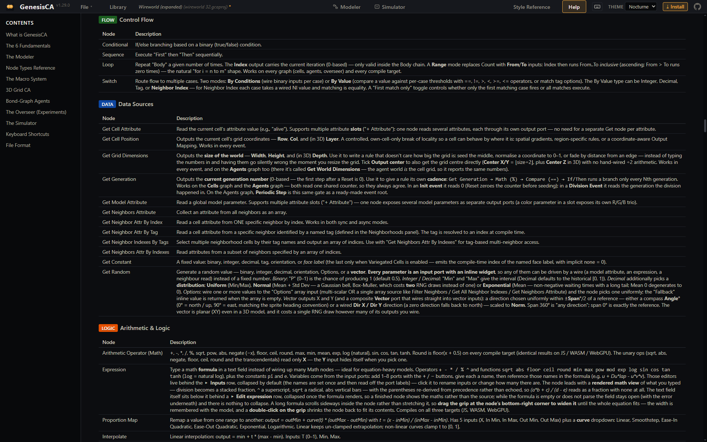

### **Install & Offline**
GenesisCA is an installable [Progressive Web App](https://web.dev/explore/progressive-web-apps). Open it in Chrome or Edge and use the navbar **⤓ Install** button (or the browser's own install affordance) to add it as a standalone desktop app, its own window and icon (no tabs or address bar), that **runs fully offline**: the app, the Models Library, previews, and your work are served from a local cache. A standalone portable **`GenesisCA.exe`** (a [Tauri](https://tauri.app) shell wrapping the same build) is published to the [Releases](https://github.com/rff255/GenesisCA/releases/latest) page: download and run it directly, no install needed (it runs from anywhere, e.g. a USB stick).

### **Example**
Gray-Scott Reaction-Diffusion model `[Peter Gray & Stephen K. Scott (1983)]`:


**Other**

<table>
  <tr>
    <td align="center" width="25%"><br/><sub>1D Elementary CA, Rule 90</sub></td>
    <td align="center" width="25%"><br/><sub>Wireworld (expanded)</sub></td>
    <td align="center" width="25%"><br/><sub>Gray-Scott (still)</sub></td>
  </tr>
  <tr>
    <td align="center" width="25%"><br/><sub>Game of Life</sub></td>
    <td align="center" width="25%"><br/><sub>Coagulation</sub></td>
    <td align="center" width="25%"><br/><sub>1D Elementary CA, Rule 110</sub></td>
  </tr>
</table>

---

## The GenesisCA Model Definition

### Six Fundamentals

Every GenesisCA model satisfies these theoretical properties:

1. Cells have unlimited computing power
2. Cells have N internal attributes (of multiple data types), whose snapshot of values at a given generation is called its "state"
3. Cells are limited to only access (read) the states of cells in one of the neighborhoods defined in the CA model
4. **Writability**: In synchronous (classic) mode, cells can only modify their own attributes. In asynchronous mode, cells can also directly modify the attributes of neighboring cells, enabling movement and mass-conservation rules.
5. Space and Time are discrete (cells arranged in n-dimensional grid)
6. **Synchronicity**: Model can be either synchronous (all cells update simultaneously, classic CA) or asynchronous (cells update sequentially, enabling number-conserving models)

### Simulation Essentials (Color Mappings)

Beyond the six fundamentals, two types of mappings enable visualization and interaction:

1. **Attribute-Color Mappings**: N ways to map cell state to colors (for visualization)
2. **Color-Attribute Mappings**: N ways to map colors to cell state (for user interaction and image-based initialization)

### Model Structure

A complete GenesisCA model definition consists of:

1. **Model Properties**
   - 1.1. Presentation (Name, Rule Author, GenesisCA Project Author, Description, Tags)
   - 1.2. Structure (Topology, Boundary Treatment, Grid Size)
   - 1.3. Execution (Update Mode, optional End Conditions: max generations + indicator rules)

2. **Attributes**, each has a name, type (binary, integer, decimal, tag, vector, color, NeighborIndex), description, and a default value
   - 2.1. Cell Attributes (per-cell state), including NeighborIndex for cells that point at one of their neighbors (movement direction, leader-follower, etc.) and **Vector** (a stored 2D/3D direction, a flow field, a facing, an accumulated force, read/written as one value via Make/Break Vector, and available for agent attributes and Local Variables too). Cell attributes can also be marked as **sub-attributes**, only well-defined when a parent (Tag or Binary) cell attribute is in a chosen value set, e.g. *charge* defined only on Wire (wireworld model). The compiler auto-injects parent-check guards at every read site so rules express "count head-charges around me" directly, with no manual filter-by-type chains
   - 2.2. Model Attributes (global parameters that all cells can read but not write; adjustable at runtime in the Simulator)

3. **Neighborhoods**: a list of neighborhoods, each being a list of relative offsets from the central cell (margin up to 20), optionally including the central cell (`[0,0]`) itself

4. **Color Mappings**: each mapping has a Name, Description, per-channel descriptions (R, G, B)
   - 4.1. Color-Attribute Mappings (input: for initialization, brush tool, and image import)
   - 4.2. Attribute-Color Mappings (output: for visualization modes)

5. **Indicators**: quantitative monitoring variables, either standalone (read/write from graph) or linked to cell attributes (auto-computed aggregations: frequency, total)

6. **Update Rules**: a node graph defining what each cell computes per generation, compiled at edit time to one of three targets: WebAssembly (default), WebGPU, or JavaScript (debug / reference). All three compilers apply *value sinking*: value computations that are only consumed inside a specific switch case or if branch are emitted *inside* that branch rather than always at cell-top, so on type-dispatch models (Wireworld, etc.) the dominant cell type pays only for the work its branch actually needs.

---

## Features

A high-level tour. Every feature has a detailed reference in the **in-app Help tab** and in [`docs/`](docs/).

### Design rules visually, not in code

Build a model's update rule as a node graph, wire reads, math, conditions and writes together and it compiles as you edit, with no programming and no build step. Groups, comments, reusable macros, search, undo/redo and a keyboard-driven quick-add menu keep large graphs workable.

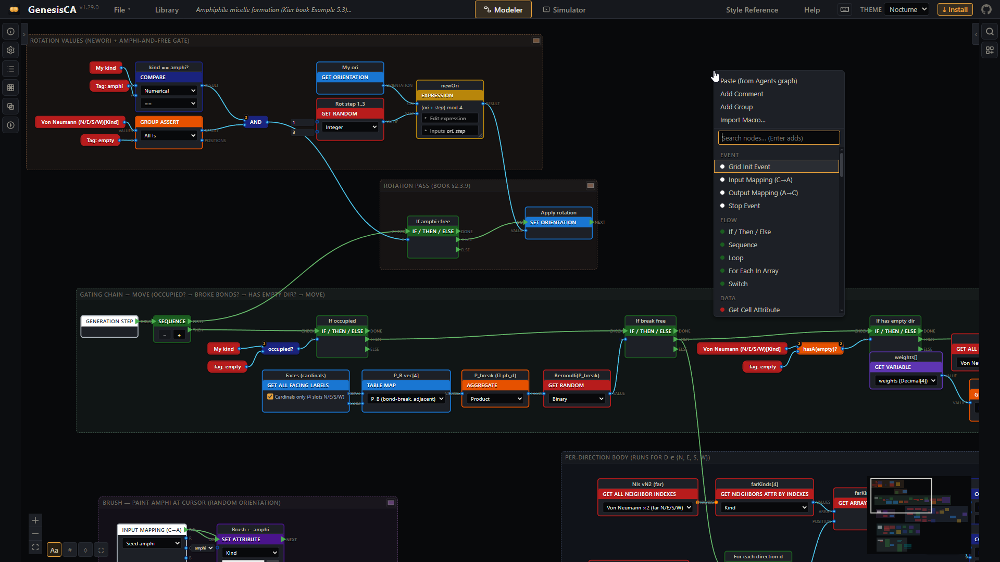
> *Node-graph editor with context menu open. Amphiphile micelle formation rule*

### Define the whole model, not just the rule

Cells carry as many attributes as you like (binary, integer, decimal, tag, colour, vector, neighbour handle). Neighbourhoods are generated parametrically from a named shape (Moore, von Neumann, disk, ring, range-N) in both 2D and 3D, or drawn by hand on a grid, and colour mappings translate state into pixels and pixels back into state, either auto-generated from a single attribute or authored as their own graph.

### Three engines, one choice

Models compile to **WebAssembly** or **WebGPU**; the default **Auto** setting picks the fastest engine your model can actually run on, and says which and why. A readable JavaScript build is always available as the reference implementation. The app stays honest about what it is doing: a compatibility readout explains every restriction, a pipeline view lists each phase of a generation, and diagnostics report which fast paths actually engaged.

<table>
  <tr>
    <td align="center" width="25%">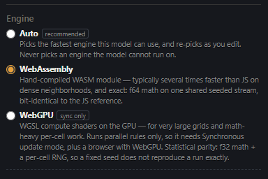<br/><sub>WASM or WebGPU. JavaScript always generated</sub></td>
    <td align="center" width="25%">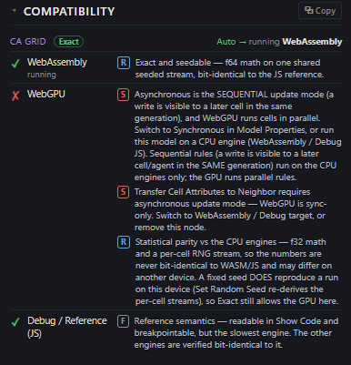<br/><sub>Compatibility breakdown per model</sub></td>
    <td align="center" width="25%">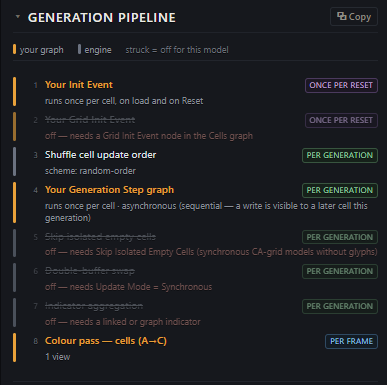<br/><sub>How/when your rule/events runs</sub></td>
  </tr>
</table>

<!-- > *Engine selection and the compatibility readout* -->

### 2D grids, 3D volumes

Flip one switch and the lattice becomes a `W×H×D` volume, rendered as lit voxels you can orbit, slice open and paint through, same rules, same engines, same tooling.

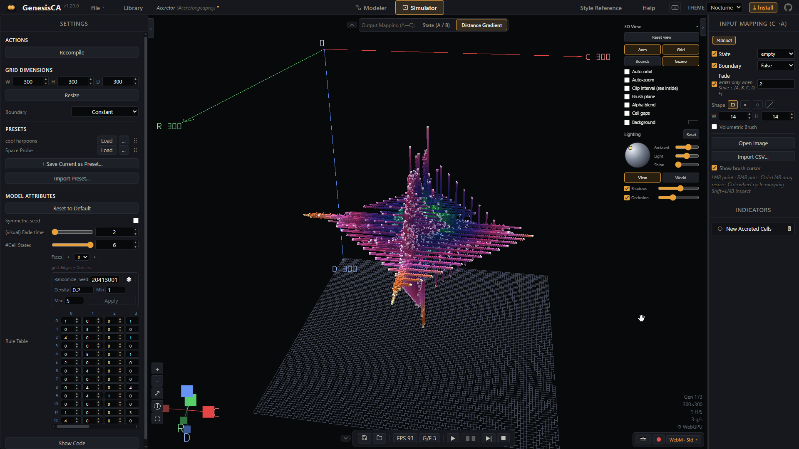
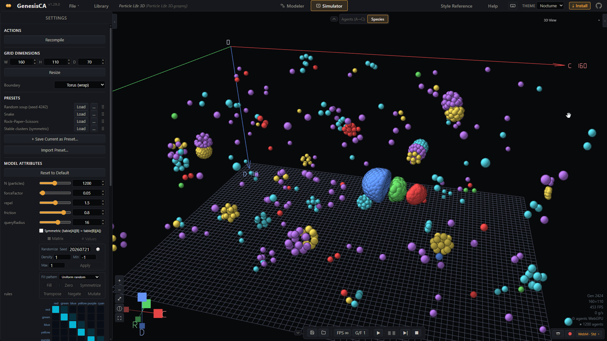
> 📸 *3D voxels and 3D agents view*

### Agents, tissue and graph automata

An optional second engine adds agents that float in continuous space instead of sitting on a grid: they sense each other, are pushed by forces your graph authors, bond together, grow and divide, while the grid CA doubles as the chemical field they secrete into and sense, closing the loop between the two. Bonds carry their own state and can be rewired, so structurally-dynamic and graph-rewriting automata are first-class citizens; agents draw as circles, sprites or one fused metaball surface.

<table>
  <tr>
    <td align="center" width="25%">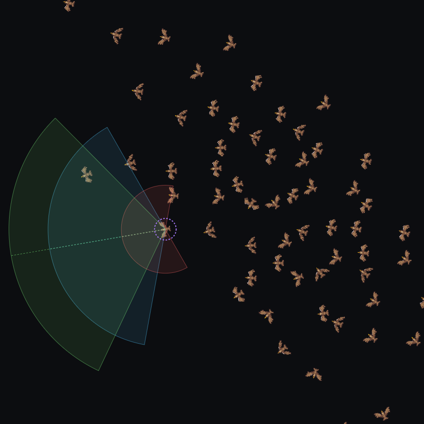<br/><sub>2D agents with sprites</sub></td>
    <td align="center" width="25%">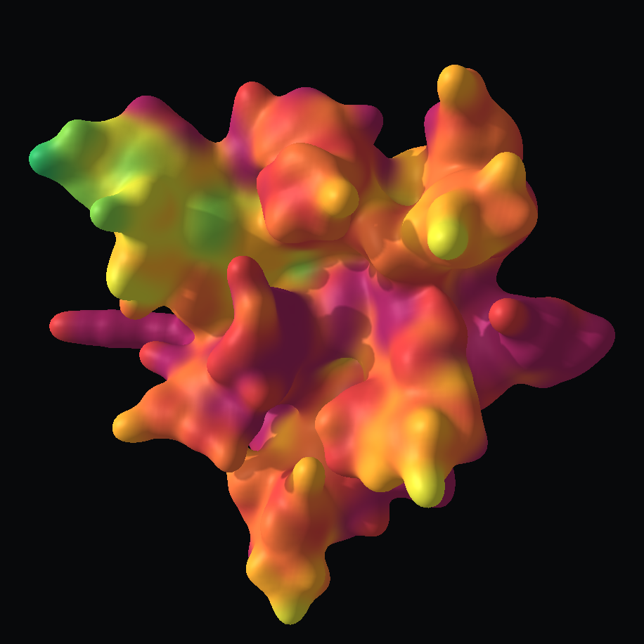<br/><sub>3D Morphogenesis (Metaballs)</sub></td>
    <td align="center" width="25%">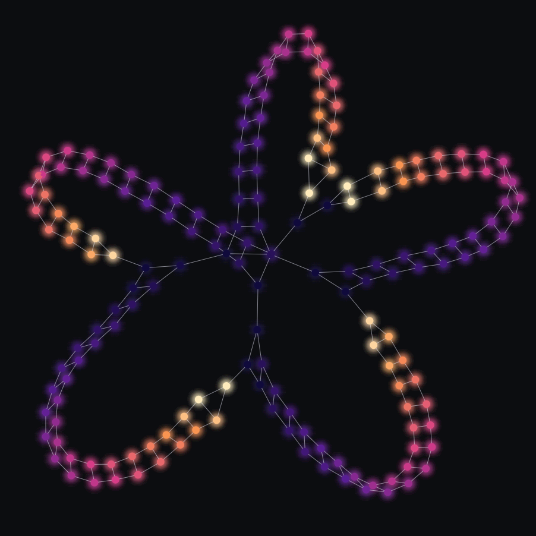<br/><sub>2D Growing Graph</sub></td>
  </tr>
</table>

### Measure it, then experiment on it

Indicators turn a running model into numbers: counts, totals, distributions, spatial profiles, graph metrics, charted live and exportable. The optional **Overseer** is a third graph that scripts experiments *around* the simulation: repeat seeded runs, sweep parameters, run until a stop condition, and aggregate the results into statistics and figures, so a set of runs becomes one reproducible experiment.
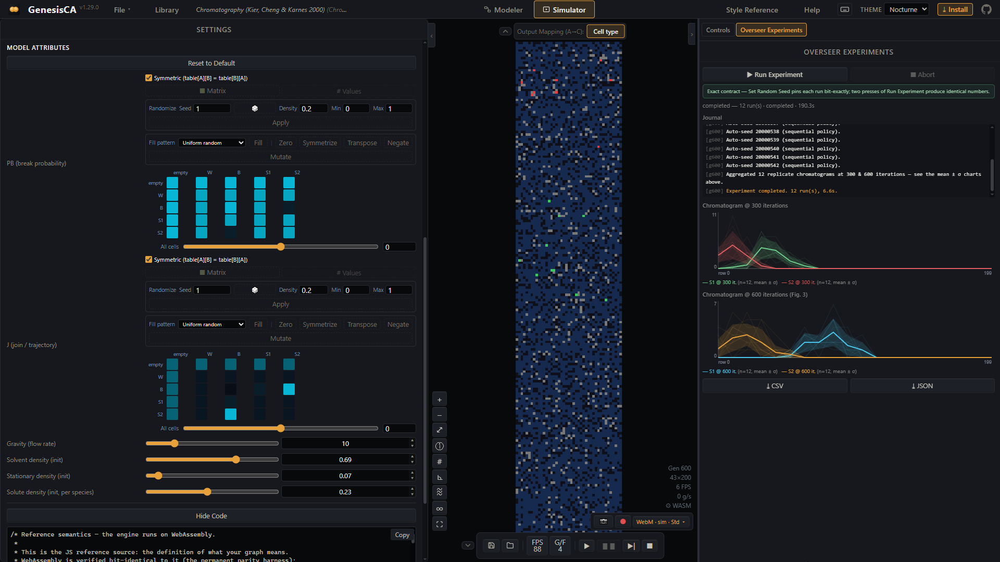
> *(on the right) Indicator aggregate charts from Overseer Experiments tab. Chromatography (Kier, Cheng & Karnes 2000) model*

### Interact while it runs

Paint with a shaped brush, inspect any cell or agent, copy and paste regions, drop an image or a CSV file onto the grid, and retune global parameters live without recompiling. Named presets snapshot parameter sets (and optionally the board itself), so one model can carry many behaviours.

### Capture and share

Export PNG stills and WebM or GIF recordings, framed either to the whole world or to your current view. **Export standalone simulation** bundles the simulator and one model into a single self-contained `.html` file that runs offline in any browser, and loads back into GenesisCA as a complete, editable model.

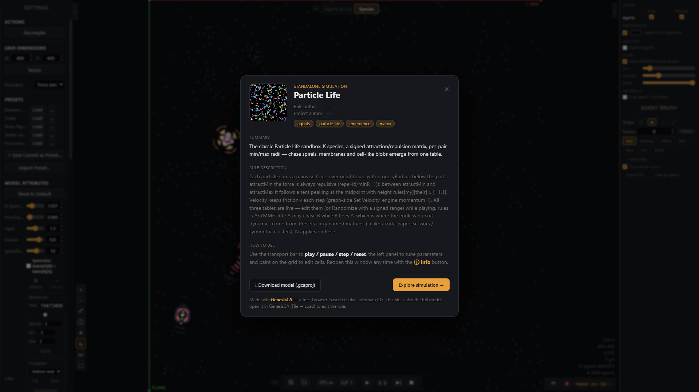
> *An exported standalone simulation of a Particle Life setup*

### Learn from the library

Dozens of ready-made models: classics, chemistry, reaction-diffusion, morphogenesis, flocking, graph automata, searchable, filterable, and forkable as the starting point for your own.

### Runs anywhere, works offline

Install it from the browser as a standalone desktop app, or download the portable Windows executable. Either way it needs no network, no account and no server, see [Install & Offline](#install--offline) above.

---

## Documentation

- [Node Reference](docs/NODES_REFERENCE.md): full catalogue of all 154 node types (including the Bond-Graph Agents and Overseer families), port schemas, and compile-time semantics, with Mermaid diagrams of common patterns.
- [CA Literature Review](docs/CA_LITERATURE_REVIEW.md): a survey of ~70 canonical cellular-automata models across physics, chemistry, biology, ecology, sociology, transport, earth sciences, CS theory and cryptography, with a shortlist driving GenesisCA's feature roadmap.

---

## Getting Started (if you want to contribute, fork or run the code locally)

### Prerequisites

- [Node.js](https://nodejs.org/) 18+ (22 LTS recommended)
- npm 9+ (comes with Node.js)

### Setup

```bash
git clone https://github.com/rff255/GenesisCA.git
cd GenesisCA
npm install
npm run dev
```

The app opens by default at **http://localhost:5173**. But if not available, it will find a different port.

### Available Scripts

| Command | What it does |
|---------|--------------|
| `npm run dev` | Start development server with hot reload |
| `npm run build` | Type-check and build for production |
| `npm run preview` | Preview the production build locally |
| `npm run generate-pwa-assets` | Regenerate the PWA icon set from `public/icon.svg` |
| `npm run tauri build` | Build the native desktop app (needs Rust, see below) |

### Native desktop build (Tauri)

A [Tauri v2](https://v2.tauri.app) shell in `src-tauri/` wraps the same web build in a lightweight native window (the OS webview, WebView2 on Windows). It builds a **standalone portable `GenesisCA.exe`**, no installer (`bundle.active: false`); the PWA is the main install path, and the exe is for running offline from anywhere, e.g. a USB stick. The native version is read from `package.json`, so it always matches the web app.

Building needs the [Rust toolchain](https://www.rust-lang.org/tools/install) (`rustup`) in addition to Node; on Windows, WebView2 ships with Windows 10/11. With Rust installed:

```bash
npm run tauri dev                  # run the app in a native window
npm run tauri build -- --no-bundle # produce the portable exe (target/release/genesisca.exe)
```

CI builds and publishes the portable Windows `.exe` to [Releases](https://github.com/rff255/GenesisCA/releases/latest) on every `v*` tag (`.github/workflows/release.yml`). It's unsigned, so the first run shows a Windows SmartScreen prompt, click **More info → Run anyway**.

> Note: WebGPU is only guaranteed on the Windows (WebView2/Chromium) native build; macOS/Linux Tauri builds use WebKit, where the simulator falls back to the WASM/JS compile targets.

### Tech Stack

- **TypeScript + React**: UI framework
- **Vite**: build tool and dev server
- **React Flow**: node-based graph editor
- **Canvas2D**: grid rendering
- **Web Workers**: off-thread simulation engine
- **vite-plugin-pwa + Workbox**: installable, offline-capable PWA (service worker + manifest)
- **Tauri v2**: native desktop shell (standalone portable `.exe`; cross-platform capable)
- **CSS Modules**: scoped component styling

---

## License

This project is licensed under the **GNU General Public License v3.0**, see the [LICENSE](LICENSE) file for details.
