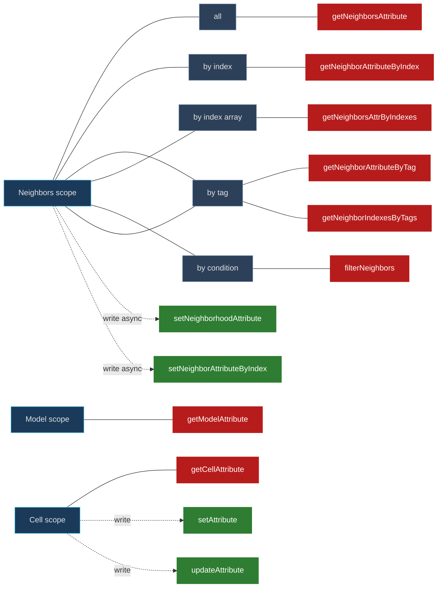
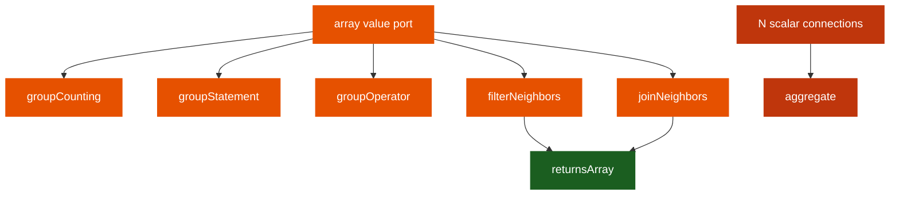
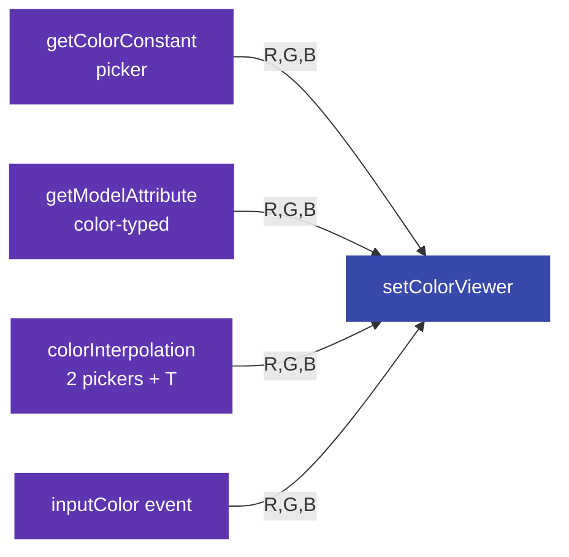
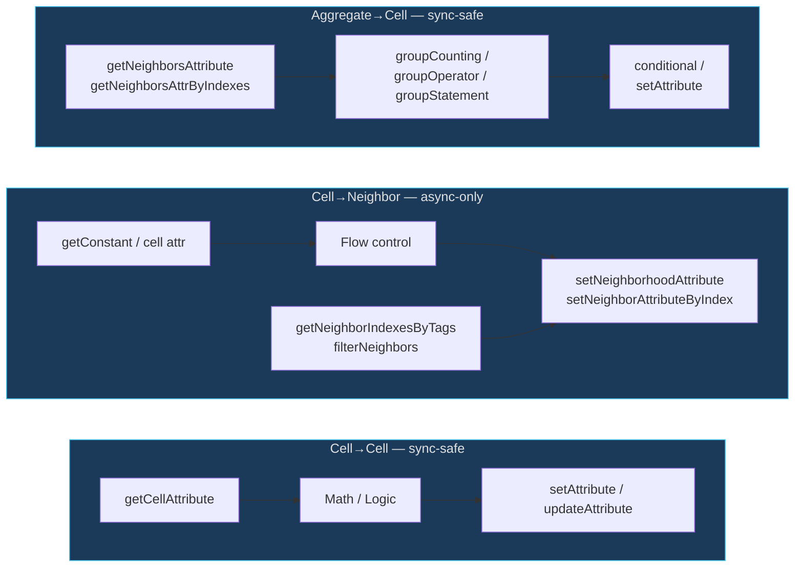

# GenesisCA — Node Reference

This document catalogues every node in the GenesisCA Visual Programming Language (VPL),
describes the port type system, and flags redundancies or gaps. It is a working reference
to inform future consolidation — it does **not** describe any committed refactoring.

**Scope:** 40 visible node types across 7 categories, plus 2 hidden boundary nodes
(`macroInput` / `macroOutput`).

---

## 1. Overview

A GenesisCA model's per-generation behaviour is defined by a **graph of nodes connected
by edges**. The graph is compiled (once, at edit time) into a JavaScript function that
runs over every cell every generation.

Every node has:

- a **category** (colour-coded in the Modeler),
- zero or more **input ports** and zero or more **output ports**,
- an optional **configuration object** (dropdowns, inline widgets) whose values are
  stored on the node instance.

Ports come in two **kinds** and two **categories**:

| Port category | Visual | Meaning |
|---|---|---|
| `flow` | green, animated dashed line | Execution order — analogous to an event or continuation |
| `value` | blue, solid line | Carries data (numbers, booleans, tags, arrays of those) |

Event nodes (`step`, `inputColor`, `outputMapping`) are the **entry points** — each one
is a root the compiler starts from. A flow chain from an event determines what runs,
and in what order, for the corresponding phase (main generation / paint / color pass).

Value nodes compute their output based on their inputs. They are evaluated on demand
by downstream consumers.

---

## 2. Port Type System

| Data type | Semantics | Scalar | Array | Inline widget |
|---|---|---|---|---|
| `bool` | 0 / 1 (stored in `Uint8Array`) | yes | yes | `bool` (dropdown) |
| `integer` | whole number (stored in `Int32Array` for attrs; plain JS number elsewhere) | yes | yes | `number` |
| `float` | decimal (`Float64Array` for attrs) | yes | yes | `number` |
| `tag` | index into a named-values list (`Int32Array`) | yes | yes | `tag` (dropdown) |
| `color-r/g/b` | 3 integer channels — emitted as separate ports (no single "color" type) | yes | — | `color` (on triples) |
| `any` | type-agnostic; most ports use this | yes | depends on `isArray` | varies |

**Notable non-obvious rules**

- The compiler does not verify data-type matches when connecting value ports. Connections
  are only blocked by **category** (flow↔flow, value↔value) and structural checks
  (cycles, self-connection, duplicate targets unless the input has `isArray: true`).
- A port with `isArray: true` expects an array; some aggregation inputs (`aggregate.Values`)
  additionally accept **multiple simultaneous connections** on the same port, producing
  an array from the individual scalars upstream.
- Colors are **not a first-class type**. Every "color" is always transported as three
  separate `integer` ports (`r`, `g`, `b`). See §5 for discussion.
- Unconnected input ports fall back to an inline widget value when one is defined; if no
  inline widget is defined and the port is unconnected, the compiler uses a type-
  appropriate default (`0`, `false`, or an empty array).

**Handle ID format** (used only in serialization): `${kind}_${category}_${portId}`
— e.g. `input_value_values`, `output_flow_body`. See
[src/modeler/vpl/types.ts](../src/modeler/vpl/types.ts).

---

## 3. Full Node Catalogue

Grouped by category. `I` = input port, `O` = output port, `(arr)` = array port.

### 3.1 Events — `event` (entry points)

| # | Type | Label | Description | Ports | Notes |
|---|---|---|---|---|---|
| 1 | `step` | Generation Step | Main per-cell update for each generation. | `O: DO` (flow) | Singleton — one per graph |
| 2 | `inputColor` | Input Mapping (C→A) | Triggered by painting on the simulator canvas. | `O: DO` (flow), `O: R` `O: G` `O: B` (int) | Requires `mappingId` |
| 3 | `outputMapping` | Output Mapping (A→C) | Computes cell colour for a viewer. | `O: DO` (flow) | Requires `mappingId`; runs once/frame after all steps |

### 3.2 Flow Control — `flow`

| # | Type | Label | Description | Ports | Notes |
|---|---|---|---|---|---|
| 4 | `conditional` | If / Then / Else | Branch on bool. | `I: CHECK` (flow) `I: IF` (bool) / `O: THEN` `O: ELSE` (flow) | |
| 5 | `sequence` | Sequence | Execute two flows in order. | `I: DO` / `O: FIRST` `O: THEN` (flow) | |
| 6 | `loop` | Loop | Repeat flow N times. | `I: DO` (flow) `I: COUNT` (int) / `O: BODY` (flow) | |
| 7 | `switch` | Switch | Multi-way branch (by value or conditions). | `I: CHECK` (flow) `I: VALUE` (optional) / dynamic `O: CASE_N` + `O: DEFAULT` | 2 modes: `conditions` (per-case bool inputs) or `value` (compare to cases); optional `firstMatchOnly` |
| 8 | `macro` | Macro | Reusable sub-graph. | dynamic — ports from `MacroDef.exposedInputs/Outputs` | Requires `macroDefId`; compiler inlines the subgraph |
| 9 | `stopEvent` | Stop Event | Terminates the simulation run with a user-defined message when its flow input fires. | `I: DO` (flow) | Text widget on body holds the message; first triggered stop in a step wins |

### 3.3 Data readers — `data`

| # | Type | Label | Description | Ports | Notes |
|---|---|---|---|---|---|
| 9 | `getCellAttribute` | Get Cell Attribute | Read current cell's attribute. | `O: Value` (any) | Requires `attributeId` |
| 10 | `getModelAttribute` | Get Model Attribute | Read global model-level attribute. | `O: Value` OR `O: R/G/B` (if attr is a color) | Requires model-level `attributeId` |
| 11 | `getNeighborsAttribute` | Get Neighbors Attribute | Read attr of **every** neighbor → array. | `O: Values` (arr) | Requires `neighborhoodId` + `attributeId`; allocates a scratch array per cell |
| 12 | `getNeighborAttributeByIndex` | Get Neighbor Attr By Index | Read **one** neighbor by index. | `I: INDEX` (int) / `O: Value` | Requires `neighborhoodId` + `attributeId`; read-only so sync-safe. Accepts an array index input (uses element 0). |
| 13 | `getNeighborAttributeByTag` | Get Neighbor Attr By Tag | Read **one** neighbor by neighborhood-tag name. | `O: Value` | Requires tag in the neighborhood's `tags` map |
| 14 | `getNeighborIndexesByTags` | Get Neighbor Indexes By Tags | Return neighborhood indices matching a set of tag names. | `O: Indexes` (arr) | Dynamic config rows per tag |
| 15 | `getNeighborsAttrByIndexes` | Get Neighbors Attr By Indexes | Read attr values for a given index array. | `I: INDEXES` (int arr) / `O: Values` (arr) | Pair with `filterNeighbors` or `getNeighborIndexesByTags` |
| 16 | `getConstant` | Get Constant | Emit fixed bool/int/float/tag. | `O: Value` | `constType` + `constValue` config |
| 17 | `getRandom` | Get Random | Random bool/int/float. | `I: P` (float, bool mode only) / `O: Value` | Bool mode: `probability` input; Int mode: min/max config |
| 18 | `tagConstant` | Tag Constant | Emit a fixed tag value. | `O: Value` (int = tag index) | Hidden from Add-Node menu; created contextually |
| 19 | `getIndicator` | Get Indicator | Read a standalone indicator's value. | `O: Value` (any) | Requires `indicatorId` |

### 3.4 Logic & Math — `logic`

| # | Type | Label | Description | Ports | Notes |
|---|---|---|---|---|---|
| 20 | `arithmeticOperator` | Math | `+ − × ÷ % sqrt pow abs max min mean`. | `I: X` `I: Y` (num) / `O: Result` | Unary ops (`sqrt`, `abs`) ignore `Y` |
| 21 | `proportionMap` | Proportion Map | Linear remap `X ∈ [inMin..inMax] → [outMin..outMax]`. | `I: X`, `I: inMin`, `I: inMax`, `I: outMin`, `I: outMax` / `O: Result` | |
| 22 | `interpolation` | Interpolate | `T ∈ [0,1] → [Min..Max]`. | `I: T`, `I: Min`, `I: Max` / `O: Result` | |
| 23 | `statement` | Compare | `== != > < >= <=` on two scalars, or `Between` / `Not Between` (range check with configurable low/high sides). | `I: X` `I: Y` `I: Y₂` (between-family only) / `O: Result` (bool) | Name collision risk with `groupStatement` |
| 24 | `logicOperator` | Logic | `AND OR XOR NOT` on bools. | `I: A` `I: B` (hidden for NOT) / `O: Result` (bool) | |

### 3.5 Aggregation — `aggregation`

| # | Type | Label | Description | Ports | Notes |
|---|---|---|---|---|---|
| 25 | `groupCounting` | Count Matching | Count array values matching a comparison vs X, or falling inside/outside an interval (`Between` / `Not Between`). | `I: Values` (arr) `I: Compare` `I: Compare High` (between-family only) / `O: Count` (int) `O: Indexes` (arr) | Configurable op |
| 26 | `groupStatement` | Group Assert | Assertion across array (all/none/any, greater/lesser). | `I: Values` (arr) `I: X` (opt) / `O: Result` (bool) `O: Indexes` (arr) | 7 operations in one dropdown |
| 27 | `groupOperator` | Group Reduce | `Sum Product Min Max Mean AND OR Random` on an array. | `I: Values` (arr) / `O: Result` `O: Index` (for min/max/random) | |
| 28 | `aggregate` | Aggregate | Combine **multiple connections** into one value. | `I: Values` (arr, multi-connect) / `O: Result` | Unlike `groupOperator` which takes an array, this takes N scalar edges |
| 29 | `filterNeighbors` | Filter Neighbors | Keep neighbor indices where attr passes a comparison. | `I: INDEXES` (arr) `I: Compare` / `O: Result` (arr) | Configurable neighborhood + attribute + op |
| 30 | `joinNeighbors` | Join Neighbors | `Intersection (AND) / Union (OR)` of two index arrays. | `I: A` `I: B` (arr) / `O: Result` (arr) | |

### 3.6 Output (writers) — `output`

| # | Type | Label | Description | Ports | Notes |
|---|---|---|---|---|---|
| 31 | `setAttribute` | Set Attribute | Write value to current cell's attribute. | `I: DO` (flow) `I: Value` / — | |
| 32 | `updateAttribute` | Update Attribute | In-place modify current cell's attribute. | `I: DO` (flow) `I: Value` (hidden on unary ops) / — | Ops: `+` `-` `max` `min` `toggle` `or` `and` `next` `previous` |
| 33 | `setNeighborhoodAttribute` | Set Neighborhood Attribute | Write to **every** neighbor's attribute. | `I: DO` `I: Value` / — | **Async-only**; sync would be corrupted by copy pass |
| 34 | `setNeighborAttributeByIndex` | Set Neighbor Attr By Index | Write to one neighbor by index. Array index input loops and writes to every listed neighbor. | `I: DO` `I: INDEX` `I: Value` / — | **Async-only** |
| 35 | `setIndicator` | Set Indicator | Assign value to an indicator. | `I: DO` `I: Value` / — | |
| 36 | `updateIndicator` | Update Indicator | In-place modify an indicator. | `I: DO` `I: Value` (hidden on unary ops) / — | Ops same as `updateAttribute` |

### 3.7 Colour — `color`

| # | Type | Label | Description | Ports | Notes |
|---|---|---|---|---|---|
| 37 | `setColorViewer` | Set Color Viewer | Write R/G/B to the output mapping's color buffer. | `I: DO` (flow) `I: R` `I: G` `I: B` / — | Used in `outputMapping` chains |
| 38 | `getColorConstant` | Color Constant | Emit a fixed RGB triple. | `O: R` `O: G` `O: B` (int) | |
| 39 | `colorInterpolation` | Color Interpolate | Linearly interpolate between two RGB colors by `T`. | `I: T` (float) `I: R1 G1 B1 R2 G2 B2` / `O: R` `O: G` `O: B` | |

### Hidden / auto-generated

| Type | Label | Purpose |
|---|---|---|
| `macroInput` | Macro Input | Boundary node — outputs the macro's exposed inputs. Created automatically when a macro is made. Ports are dynamic. |
| `macroOutput` | Macro Output | Boundary node — inputs the macro's exposed outputs. Created automatically when a macro is made. Ports are dynamic. |

---

## 4. Redundancy Analysis

### 4.1 Attribute access cluster (6 readers, 4 writers)

**Observations**

- **Six ways to read** an attribute depending on scope × selector. Naming is inconsistent:
  `getNeighborsAttribute` returns an array, `getNeighborAttributeByIndex` returns a scalar,
  `getNeighborsAttrByIndexes` returns an array again but with "Attr" (not "Attribute")
  and an arbitrary "s" pluralisation on both "Neighbors" and "Indexes". The distinction
  is real (scope vs selector cardinality) but not obvious from names alone.
- `getNeighborAttributeByTag` does single-neighbor tag lookup; `getNeighborIndexesByTags`
  does multi-neighbor tag lookup — but returns only indices, not values. There is no
  single node "read values from all neighbors matching these tags" — users must chain
  `getNeighborIndexesByTags` → `getNeighborsAttrByIndexes`.
- **Two writers** for current cell (`setAttribute`, `updateAttribute`) differ by whether
  the operation is "assign" vs "in-place modify". The modify ops have unary variants
  (`toggle`, `next`, `previous`) whose `Value` input port is hidden — a reasonable
  solution but requires users to know which op is unary.
- **Neighbor writers are async-only** and have no inline widget (unlike `setAttribute`),
  so setting a neighbor to a literal value requires adding an explicit `getConstant`.
- **`setNeighborAttributeByIndex` accepts an array index input** (e.g. wired from
  `getNeighborIndexesByTags` or `filterNeighbors`) and loops, writing to every listed
  neighbor. This means there is no separate "Set Neighbors By Indexes" node — the same
  node handles both single-neighbor and multi-neighbor writes. `getNeighborAttributeByIndex`
  also accepts an array index but, since its output is scalar, falls back to element 0.

### 4.2 Aggregation cluster

**Observations**

- `aggregate` vs `groupOperator` — both reduce to one scalar, both have similar
  operations (Sum / Product / Max / Min / Mean / AND / OR). The difference is that
  `aggregate` accepts multiple *scalar* edges on one port (auto-assembled into an array
  at compile time) while `groupOperator` takes a pre-assembled array input. No
  indication in either UI of when to prefer which.
- `groupCounting`, `groupStatement` both take an array + a scalar "compare" value, but
  one returns a count (and optional matching indices) while the other returns a bool
  (and optional indices). Both overlap with `filterNeighbors` for the common case
  "how many neighbors have attribute > X" which requires either:
  (a) `getNeighborsAttribute` → `groupCounting(greater, X)` → `.count`, or
  (b) `getNeighborsAttribute` → `filterNeighbors(greater)` against a constant → array-
      length (which is not directly exposed — would need `groupCounting(equals)` with
      trivial comparison).
- `joinNeighbors` operates only on index arrays (AND/OR of integer sets). Non-symmetric
  with `filterNeighbors` which takes index array + comparison.

### 4.3 Color cluster

**Observations**

- No first-class "color" port type. Every color transit requires three edges
  (or three inline widget values). This makes simple flows like "paint cell the
  brush color" verbose.
- Color pickers are re-implemented in three nodes: `getColorConstant`, `colorInterpolation`,
  and `setColorViewer` (on its R/G/B inline widgets).
- `getModelAttribute` becomes 3-port when the attribute is color-typed — a type-aware
  port set. No other node has this behaviour.

---

## 5. Data Flow Patterns

GenesisCA models fall into three broad "realms" depending on where the cell writes to:

**Rules of thumb**

- **Game of Life-style** rules are Realm 1 + Realm 3: read neighbors, count matches,
  branch on count, write own attribute. No `setNeighborhoodAttribute`.
- **Particle / mass-conserving** rules need Realm 2: move values between cells. Requires
  `updateMode: 'asynchronous'` in model properties.
- **Color-only mappings** (Attribute→Color) live in Realm 1 via the `outputMapping` event
  entry point, ending in `setColorViewer`.

---

## 6. Gaps and Recommendations

These are **ideas**, not committed work. They inform future passes on the node system.

### 6.1 Missing utility nodes

- **Clamp** — `clamp(x, min, max)`. Currently requires `arithmeticOperator(min, max)` +
  `arithmeticOperator(max, min)`.
- **Integer cast** / **Float cast** — no explicit conversion. `Math.floor(x)` would need
  an extension to `arithmeticOperator`.
- **Array length** — `getNeighborsAttribute.Values.length` is inaccessible. Workaround:
  use `groupCounting(notEquals, some-sentinel)` or read `neighborhood.coords.length` —
  but neither is discoverable.
- **Array element** — no "get N-th element of array"; the closest is
  `getNeighborAttributeByIndex` for neighbor arrays specifically.
- **Conditional value** (not flow) — `ifExpr(cond, thenVal, elseVal)`. Currently requires
  `conditional` flow + two `setAttribute` writes.
- **Print / log** — no debug output node (Unreal's "Print String" equivalent).

### 6.2 Naming collisions & clarity

- `statement` (scalar compare returning bool) vs `groupStatement` (array assertion) vs
  `logicOperator` (bool combinator). Consider renaming `statement` → `compare` and
  `groupStatement` → `assertArray` or similar.
- `getNeighborsAttribute` (array) vs `getNeighborsAttrByIndexes` (array) vs
  `getNeighborAttributeByIndex` (scalar): plural "s" indicates array, but the
  singular "ByIndex" (not "ByIndexes") muddies the pattern.
- Colour-picker and color-channel nodes don't use a consistent vocabulary —
  `getColorConstant` vs `setColorViewer` vs `colorInterpolation` all refer to colors
  but from different angles.

### 6.3 Consolidation proposals

These would reduce the palette's cognitive load:

- **Unified `getAttribute`** with three config dropdowns: `scope ∈ {cell, model, neighbor, neighbors}`,
  `selector ∈ {all, byIndex, byTag, byTagSet, byFilter}`, `attributeId`. Replaces nodes
  9-15 (7 nodes → 1). The output is array-typed when the selector is multi-result,
  scalar otherwise.
- **Unified `setAttribute`** with `scope ∈ {cell, neighbor, neighborhood}`,
  `operation ∈ {assign, +, -, max, min, toggle, next, prev}`. Replaces nodes 31-34
  (4 → 1). Async-only scopes would display a note in the node body when the model's
  `updateMode` is sync.
- **First-class `color` port type**: add a `color` data type carried as a single value
  (RGBA packed into an int, or an object). Adjust color-consuming nodes to take a single
  `Color` input. Current R/G/B ports still available for fine control when needed.
- **Array namespace**: merge `groupCounting`, `groupStatement`, `groupOperator`,
  `aggregate`, `filterNeighbors`, `joinNeighbors` into a smaller `arrayReduce` +
  `arrayFilter` + `arraySetOp` trio. Each with an operation selector covering the
  current permutations.

### 6.4 Port-system improvements

- **Type-aware connection validation**: currently only the port *category* is checked.
  The compiler tolerates bool-into-int connections but adding a visible incompatibility
  warning (not a hard block) would catch mistakes earlier.
- **Inline widgets on more ports**: neighbor writers (`setNeighborhoodAttribute`,
  `setNeighborAttributeByIndex`) have no inline widget for `Value`, forcing an extra
  `getConstant` for trivial writes. Reuse the dynamic widget pattern from `setAttribute`.

---

## Appendix A — Cross-Reference with `registry.ts`

The authoritative list is [`src/modeler/vpl/nodes/registry.ts`](../src/modeler/vpl/nodes/registry.ts).
Hidden-from-menu: `macro`, `macroInput`, `macroOutput`, `tagConstant`. Macro instances
**are** added to the graph, but via Palette / context actions — not via the Add-Node menu
(which would instantiate an empty MacroDef reference).

## Appendix B — Terms used

- **Scope** (of an attribute access): which cell(s) are being read/written — current
  cell, a specific neighbor, all neighbors, or the model-level attribute.
- **Selector**: how a neighbor set is narrowed — all, by-index, by-tag, by-tag-set,
  or by-predicate (`filterNeighbors`).
- **Realm** (of a graph flow): Cell→Cell (sync-safe), Cell→Neighbor (async-only),
  or Aggregate→Cell (sync-safe). See §5.
- **Hoisted value**: compile time — value-node outputs emitted as `const _v${nodeId}`
  before the flow chain, so they can be referenced multiple times without re-computation.
