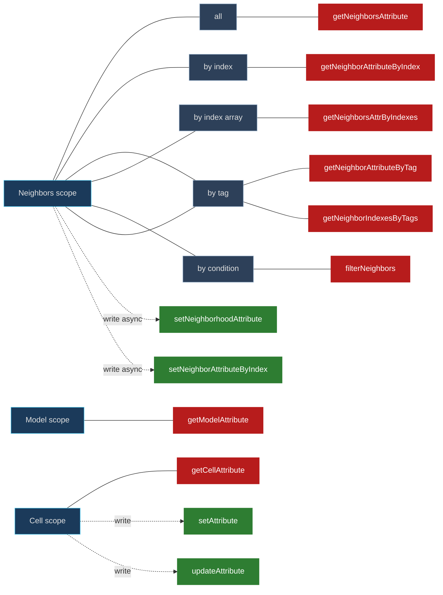
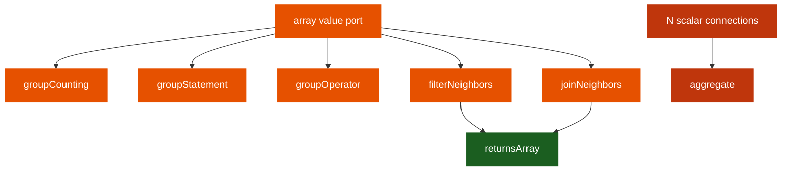
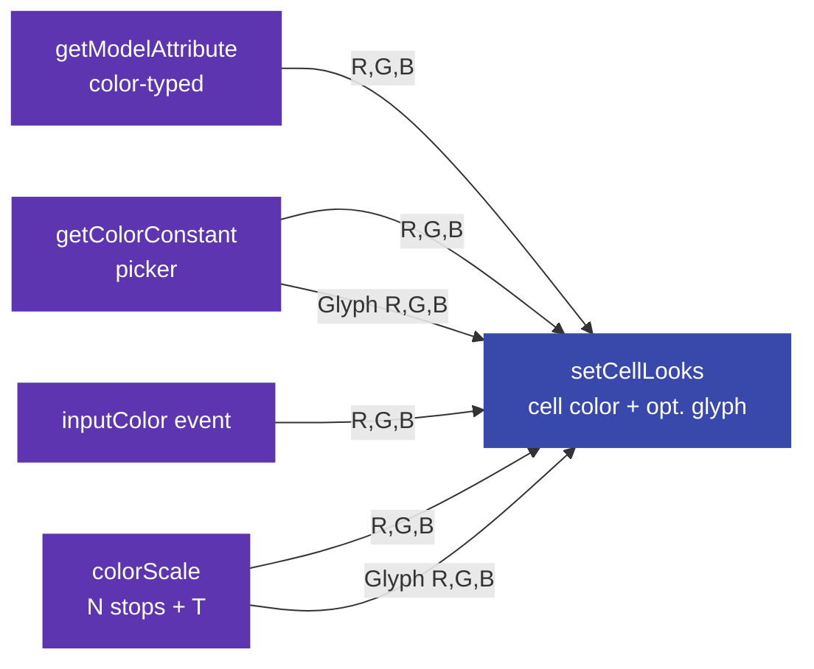
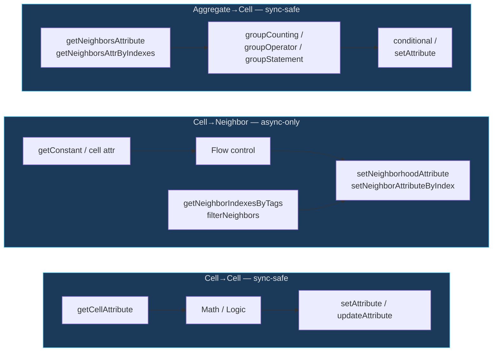

# GenesisCA — Node Reference

This document catalogues every node in the GenesisCA Visual Programming Language (VPL),
describes the port type system, and flags redundancies or gaps. It is a working reference
to inform future consolidation — it does **not** describe any committed refactoring.

**Scope:** 107 node types across 7 categories (event, flow, data, logic, aggregation,
output, color), plus 2 hidden boundary nodes (`macroInput` / `macroOutput`). Indicator
nodes live within the `data` (readers) and `output` (writers) categories rather than a
category of their own. The variegated-cells, local-variable, and Bond-Graph-Agent nodes
appear in the editor only when their respective model feature is enabled (the 39 agent
nodes — §3.8 — only in a Bond-Graph-Agents model, and only on its Agents sub-tab).

On the **Agents** sub-tab the universal Get / Set / Update Attribute nodes display as
**Get / Set / Update Self Attribute** (via `NodeTypeDef.agentLabel` / `displayNodeLabel`) —
they read/write the agent's own attribute.

**Editor-only constructs** (not counted above, no computation): comments, groups, and
**reroute points**. A reroute is a movable relay dot placed on a wire (Blender / Unreal
blueprint style) to bend connections and fan one output out to many consumers; it always
relays an *output* (one input, many outputs), can be chained, and is stripped before
compilation by `collapseReroutes` ([rerouteCollapse.ts](../src/modeler/vpl/compiler/rerouteCollapse.ts)) so `A → reroute → B`
compiles identically to `A → B` on all three targets.

---

## 1. Overview

A GenesisCA model's per-generation behaviour is defined by a **graph of nodes connected
by edges**. The graph is compiled (once, at edit time) into a JavaScript function that
runs over every cell every generation.

Every node has:

- a **category** (colour-coded in the Modeler),
- zero or more **input ports** and zero or more **output ports**,
- an optional **configuration object** (dropdowns, inline widgets) whose values are
  stored on the node instance.

Ports come in two **kinds** and two **categories**:

| Port category | Visual | Meaning |
|---|---|---|
| `flow` | green, animated dashed line | Execution order — analogous to an event or continuation |
| `value` | blue, solid line | Carries data (numbers, binary values, tags, arrays of those) |

Event nodes (`step`, `initEvent`, `inputColor`, `outputMapping`) are the **entry points** —
each one is a root the compiler starts from. A flow chain from an event determines what runs,
and in what order, for the corresponding phase (per-cell initialization on Reset / main
generation / paint / color pass).

Value nodes compute their output based on their inputs. They are evaluated on demand
by downstream consumers.

---

## 2. Port Type System

The first column is the INTERNAL type id (what `PortDef.dataType` / `Attribute.type`
store and what `.gcaproj` files serialize). The UI shows friendlier names for two of
them: `bool` renders as **Binary** and `float` as **Decimal** everywhere the user reads
a type name (see `typeDisplayName` in `src/model/typeLabels.ts`).

| Data type | UI name | Semantics | Scalar | Array | Inline widget |
|---|---|---|---|---|---|
| `bool` | Binary | 0 / 1 (stored in `Uint8Array`) | yes | yes | `bool` (dropdown) |
| `integer` | Integer | whole number (stored in `Int32Array` for attrs; plain JS number elsewhere) | yes | yes | `number` |
| `float` | Decimal | decimal (`Float64Array` for attrs) | yes | yes | `number` |
| `tag` | Tag | index into a named-values list (`Int32Array`) | yes | yes | `tag` (dropdown) |
| `neighborIndex` | NeighborIndex | slot index into a neighborhood (`Int32Array`); typed-distinct from `integer` to catch the silent index-kind hazards in §7 | yes | yes | `number` |
| `color-r/g/b` | Color | 3 integer channels — emitted as separate ports (no single "color" type) | yes | — | `color` (on triples) |
| `any` | — | type-agnostic; most ports use this | yes | depends on `isArray` | varies |

**Notable non-obvious rules**

- The compiler does not verify data-type matches when connecting value ports, **except**
  for `neighborIndex` ports: a NeighborIndex port may only connect to another
  NeighborIndex port or to an `any`-typed port. Other type mismatches (bool ↔ int,
  int ↔ float, etc.) are still allowed for back-compat. Connections are also blocked
  by **category** (flow↔flow, value↔value) and structural checks (cycles,
  self-connection, duplicate targets unless the input has `isArray: true`).
- Wiring a non-NI integer source (e.g. `groupCounting.Positions`,
  `groupOperator.Position`, `getRandom.Value`) into a NeighborIndex port surfaces an
  amber warning badge on the target node — see §7 for the index-kind hazards this
  prevents.
- A port with `isArray: true` expects an array; some aggregation inputs (`aggregate.Values`)
  additionally accept **multiple simultaneous connections** on the same port, producing
  an array from the individual scalars upstream.
- Colors are **not a first-class type**. Every "color" is always transported as three
  separate `integer` ports (`r`, `g`, `b`). See §5 for discussion.
- Unconnected input ports fall back to an inline widget value when one is defined; if no
  inline widget is defined and the port is unconnected, the compiler uses a type-
  appropriate default (`0`, `false`, or an empty array).

**Handle ID format** (used only in serialization): `${kind}_${category}_${portId}`
— e.g. `input_value_values`, `output_flow_body`. See
[src/modeler/vpl/types.ts](../src/modeler/vpl/types.ts).

---

## 3. Full Node Catalogue

Grouped by category. `I` = input port, `O` = output port, `(arr)` = array port.

### 3.1 Events — `event` (entry points)

| # | Type | Label | Description | Ports | Notes |
|---|---|---|---|---|---|
| 1 | `step` | Generation Step | Main per-cell update for each generation. | `O: DO` (flow) | Singleton — one per graph |
| 2 | `initEvent` | Init Event | Runs once per cell on simulator **Reset** (after defaults are applied, before the first colour pass). | `O: DO` (flow), `O: x` `O: y` `O: maxX` `O: maxY` (int); 3D models also expose `O: z` `O: maxZ` (int) | Singleton. Useful for procedural initial state (gradients, deterministic noise, random orientations). Not triggered by Randomize or Load State. `z`/`maxZ` are hidden in 2D models |
| 3 | `inputColor` | Input Mapping (C→A) | Triggered by painting on the simulator canvas. | `O: DO` (flow), `O: R` `O: G` `O: B` (int) | Requires `mappingId` |
| 4 | `outputMapping` | Output Mapping (A→C) | Computes cell colour for a viewer. | `O: DO` (flow) | Requires `mappingId`; runs once/frame after all steps |
| 5 | `stopEvent` | Stop Event | Terminates the simulation run with a user-defined message when its flow input fires. | `I: DO` (flow) | Text widget on body holds the message; first triggered stop in a step wins; WASM emitter mirrors the JS emit via `i32.store` at `layout.stopFlagOffset` |

### 3.2 Flow Control — `flow`

**Pass-through chaining (`next` port).** Every flow-input node except Sequence and Macro
carries a pass-through flow output (port id `next`): action nodes label it **NEXT** (their
only output) and control nodes label it **DONE** (the "Completed" continuation). On BOTH it
renders as the FIRST output port — top-right, aligned with the node's flow input — so a
chain of nodes keeps a horizontal through-line instead of drifting downward; a control
node's branch outputs (THEN/ELSE/BODY/CASE_N/DEFAULT) hang below DONE. Targets run
immediately after the node — after the whole construct for control nodes — at the same
scope, before the parent port's next sibling target (depth-first). Chaining `A.NEXT → B`
compiles byte-identically to fanning both out of the parent port, on all three targets; it
exists purely to keep graphs readable without Sequence nodes. See
[IMPACT_MAP_FLOW_PASSTHROUGH.md](IMPACT_MAP_FLOW_PASSTHROUGH.md).

| # | Type | Label | Description | Ports | Notes |
|---|---|---|---|---|---|
| 6 | `conditional` | If / Then / Else | Branch on a binary condition. | `I: CHECK` (flow) `I: IF` (bool) / `O: DONE` `O: THEN` `O: ELSE` (flow) | DONE is the FIRST output (top); runs after the if/else completes (either branch, or none) |
| 7 | `sequence` | Sequence | Execute two flows in order. | `I: DO` / `O: FIRST` `O: THEN` (flow) | No DONE — its last THEN is the continuation |
| 8 | `loop` | Loop | Repeat flow N times. | `I: DO` (flow) `I: COUNT` (int) / `O: DONE` `O: BODY` (flow) | DONE is the FIRST output (top); runs after all iterations |
| 9 | `forEachInArray` | For Each In Array | Iterates a typed array, exposing the per-iteration `Element` and its 0-based `Index`. Body action nodes can consume either directly; body value nodes that depend on `Element`/`Index` (e.g. `Math.add(element, 1) → setIndicator`, or `arrayElement(otherArr, index)`) emit inline inside the loop block on all three targets. | `I: DO` (flow) `I: Array` (any[]) / `O: DONE` (flow) `O: BODY` (flow) `O: Element` (any) `O: Index` (int) | DONE is the FIRST output (top). Full JS / WASM / WebGPU lockstep. An unwired Array skips body AND DONE |
| 10 | `switch` | Switch | Multi-way branch (by value or conditions). | `I: CHECK` (flow) `I: VALUE` (optional) / `O: DONE` + dynamic `O: CASE_N` + `O: DEFAULT` | 2 modes: `conditions` (per-case bool inputs) or `value` (compare to cases). Value-mode types: Integer / Decimal / Tag / **Neighbor Index** (NI cases are wired, equality-only). Optional `firstMatchOnly`. DONE is the FIRST output (top), re-hoisted above the dynamic CASE_N ports; runs after the matched case(s) |
| 11 | `macro` | Macro | Reusable sub-graph. | dynamic — ports from `MacroDef.exposedInputs/Outputs` | Requires `macroDefId`; compiler inlines the subgraph. No auto pass-through (expose a flow output explicitly) |

### 3.3 Data readers — `data`

> **3D Grid CA note:** the whole **`neighborIndex` node family** — `getNeighborAttributeByIndex`, `setNeighborAttributeByIndex`, `neighborIndexFromOffset`/`FromTag`, `flip`/`breakDownNeighborIndex`, `getAllNeighborIndexes`, `getNeighborIndexesByTags`, `getNeighborsAttrByIndexes`, `filterNeighbors`, `joinNeighbors`, `pick[N]RandomNeighbor` — works in **both 2D and 3D**. The packed NI codec is dimension-aware: 2D packs two 16-bit offsets `(dr, dc)`; 3D packs three 10-bit offsets `(dr, dc, dl)` (±511 per axis). `neighborIndexFromOffset` and `breakDownNeighborIndex` expose a third `dl` (layer) port that appears only in 3D models. (These nodes were 2D-only before the 3-axis codec landed on all three compile targets.)

| # | Type | Label | Description | Ports | Notes |
|---|---|---|---|---|---|
| 12 | `getCellAttribute` | Get Cell Attribute | Read current cell's attribute. | `O: Value` (any) | Requires `attributeId` |
| 12a | `getCellPosition` | Get Cell Position | Outputs the current cell's grid coordinates — a controlled, own-cell-only break of locality (spatial gradients, region rules, coordinate-aware Output Mappings). | `O: Row` (int) `O: Col` (int) `O: Layer` (int, 3D only) | Multi-output; `Layer` hidden in 2D. No config. `NEVER_INVARIANT` (per-cell). Works in every event. |
| 13 | `getModelAttribute` | Get Model Attribute | Read global model-level attribute. | `O: Value` OR `O: R/G/B` (if attr is a color) | Requires model-level `attributeId` |
| 14 | `getNeighborsAttribute` | Get Neighbors Attribute | Read attr of **every** neighbor → array. | `O: Values` (arr) | Requires `neighborhoodId` + `attributeId`; allocates a scratch array per cell |
| 15 | `getNeighborAttributeByIndex` | Get Neighbor Attr By Index | Read **one** neighbor by index. | `I: INDEX` (NI) / `O: Value` | Requires `neighborhoodId` + `attributeId`; read-only so sync-safe. Index port retyped to `neighborIndex`. |
| 16 | `getNeighborAttributeByTag` | Get Neighbor Attr By Tag | Read **one** neighbor by neighborhood-tag name. | `O: Value` | Requires tag in the neighborhood's `tags` map |
| 17 | `getNeighborIndexesByTags` | Get Neighbor Indexes By Tags | Return neighborhood indices matching a set of tag names. | `O: Indexes` (NI arr) | Dynamic config rows per tag |
| 18 | `getNeighborsAttrByIndexes` | Get Neighbors Attr By Indexes | Read attr values for a given NeighborIndex array. | `I: INDEXES` (NI arr) / `O: Values` (arr) | Pair with `filterNeighbors`, `getNeighborIndexesByTags`, or `joinNeighbors` |
| 19 | `getAllNeighborIndexes` | Get All Neighbor Indexes | Returns the full NI[] of a neighborhood — every slot, [0..nbrSize-1]. Bootstrap for filterNeighbors / forEachInArray chains without needing tags. | `O: Indexes` (NI[]) | Compile-time-resolved |
| 20 | `neighborIndexFromOffset` | Neighbor Index (from Offset) | Build a NI pointing at the (dRow, dCol) slot of the chosen neighborhood. Compile-time-resolved. | `O: Value` (NI) | Returns -1 if the offset is not in the neighborhood |
| 21 | `neighborIndexFromTag` | Neighbor Index (from Tag) | Build a NI pointing at the slot tagged with the given name. Compile-time-resolved. | `O: Value` (NI) | Same shape as fromOffset but resolves by tag name |
| 22 | `flipNeighborIndex` | Flip Neighbor Index | Mirror a NI horizontally / vertically / both. Compile-time precomputed lookup table. | `I: Index` (NI) / `O: Value` (NI) | Returns -1 when the flipped offset isn't in the configured neighborhood |
| 23 | `breakDownNeighborIndex` | Break Down Neighbor Index | Unpacks a NeighborIndex into its `(dRow, dCol)` offset components. | `I: Index` (NI) / `O: dr` `O: dc` (int) | Inverse of `neighborIndexFromOffset`; useful for direction-aware movement logic |
| 24 | `arrayElement` | Get Array Element | Returns `arr[position]` with bounds check; out-of-range yields a safe default (-1 for NI / integer, 0 for decimal, false for binary). The read counterpart of Set Array Element. | `I: Array` `I: Position` (int) / `O: Value` | Bridges Position outputs of group* nodes back to NIs via a parallel array |
| 25 | `arrayLength` | Array Length | Returns the number of elements in an array. | `I: Array` / `O: Length` (int) | |
| 26 | `getConstant` | Get Constant | Emit fixed binary / integer / decimal / tag / orientation / face label. | `O: Value` | `constType` + `constValue` config; `faceLabel` only listed when Variegated Cells is enabled (emits the compile-time integer index of the chosen label, with implicit `none`=0) |
| 27 | `getRandom` | Get Random | Random binary/integer/decimal, or pick uniformly from a wired Options array. | `I: P` (float, Binary mode only), `I: Options` (any, isArray, options mode only), `I: Fallback` (any, inline, options mode only) / `O: Value` | Bool mode: `probability` input; Int mode: min/max config; Options mode: wire scalars or array source to `Options`; `Fallback` returned on empty array |
| 28 | `getVariable` | Get Variable | Read a Local Variable's current value (scalar) or its underlying typed array (array variables — consumers iterate like any array source). | `O: Value` (any) | Requires `variableId`; output shape (scalar vs array) derived from the variable's `kind`. Per-cell scratch, reset to `initialValue` each cell |
| 29 | `getOrientation` | Get Orientation | Read the current cell's orientation (0–3 = 0/90/180/270° CW). | `O: Orientation` (int) | **Variegated Cells only** |
| 30 | `getFacingOrientation` | Get Facing Orientation | Read the orientation of the neighbour touching this cell in a fixed direction (N/E/S/W/diagonals). Does not use a neighborhood. | `O: Orientation` (int) | **Variegated Cells only**; `directionTag` config; honours boundary treatment |
| 31 | `getNeighborOrientationByIndex` | Get Neighbor Orientation By Index | Read the orientation of one neighbour by NeighborIndex. | `I: Index` (NI) / `O: Orientation` (int) | **Variegated Cells only**; read-only so works in sync + async |
| 32 | `getFacingLabels` | Get Facing Labels | Resolve the two face labels touching at a 1-step encounter in a fixed direction — accounts for both cells' orientations and face patterns. | `O: My Face` `O: Their Face` (int) | **Variegated Cells only**; `directionTag` config; no neighborhood. Pair with `lookupInteraction` |
| 33 | `getAllFacingLabels` | Get All Facing Labels | Two parallel arrays of face labels at each 1-step encounter — 8 slots (Moore N/NE/E/SE/S/SW/W/NW) or 4 slots (cardinal N/E/S/W) when `cardinalsOnly` is checked. | `O: My Faces` `O: Their Faces` (int arr) | **Variegated Cells only**. Pair with `aggregate`/`interactionTableMap` for energy sums or `forEachInArray` for per-direction logic |
| 34 | `interactionTableMap` | Table Map | Vectorised `lookupInteraction`: indexes a Lookup Table model attribute by two parallel index arrays (rows + cols) → decimal array. | `I: Rows` `I: Cols` (int arr) / `O: Values` (float arr) | Works with or without Variegated Cells; pair with `aggregate.product` for `P_break = ∏ P_B` |
| 35 | `getIndicator` | Get Indicator | Read a standalone indicator's value. | `O: Value` (any) | Requires `indicatorId` |

### 3.4 Logic & Math — `logic`

| # | Type | Label | Description | Ports | Notes |
|---|---|---|---|---|---|
| 36 | `arithmeticOperator` | Math | `+ − × ÷ % sqrt pow abs max min mean exp log sin cos tan tanh` (`log` = natural log). | `I: X` `I: Y` (num, `Y` hidden on unary ops) / `O: Result` | Unary ops (`sqrt abs exp log sin cos tan tanh`) read only `X` |
| 37 | `expression` | Expression | Type a math formula instead of wiring many Math nodes — collapses an equation-heavy chain into one node. Operators `+ − × ÷ % ^`, functions `sqrt abs floor ceil round min max pow mod exp log sin cos tan tanh` (`log` = natural log), constants `pi` `e`. Variables come from the input ports. | dynamic `I: a…h` (1–8 ports, configurable count, each renamable) / `O: Result` | Parses to a shared AST; JS / WASM / WebGPU lockstep. Scalar-only — no array/neighbour reductions. Transcendentals use `Math.*` (JS) / native intrinsics (WGSL) / imported host funcs (WASM, alongside `pow`) |
| 38 | `proportionMap` | Proportion Map | Linear remap `X ∈ [inMin..inMax] → [outMin..outMax]`. | `I: X`, `I: inMin`, `I: inMax`, `I: outMin`, `I: outMax` / `O: Result` | |
| 39 | `interpolation` | Interpolate | `T ∈ [0,1] → [Min..Max]`. | `I: T`, `I: Min`, `I: Max` / `O: Result` | |
| 40 | `statement` | Compare | `== != > < >= <=` on two scalars, or `Between` / `Not Between` (range check with configurable low/high sides). A `compareType` selector (Numerical / Bool / Tag / Neighbor Index) swaps the inline operand widgets; non-numerical types are equality-only (==/!=). Tag mode adds a tag-attribute picker (à la Get Constant). | `I: X` `I: Y` `I: Y₂` (between-family only) / `O: Result` (bool) | Name collision risk with `groupStatement` |
| 41 | `logicOperator` | Logic | `AND OR XOR NOT` on binary values. | `I: A` `I: B` (hidden for NOT) / `O: Result` (bool) | |
| 42 | `valueSwitch` | Value Switch | `condition ? ifValue : elseValue`. Pure value, no flow port. **Dual-mode:** scalar selector OR array relay. | `I: Condition` (any) `I: If` (any) `I: Else` (any) / `O: Result` (any) | All inputs optional (inline defaults: condition=false, if=1, else=0). Both branches always evaluate — for short-circuit use flow `conditional` instead. **Array relay:** when BOTH `If` and `Else` are wired to array producers (e.g. two `filterNeighbors`), `Result` is the selected array (feed it to `pickRandomNeighbor` / `arrayElement` / `aggregate` / …). All three targets — JS relays the reference, WASM selects the scratch offset/len (zero-copy), WebGPU copies the chosen branch. |
| 43 | `lookupInteraction` | Table Lookup | Index a Lookup Table model attribute by a row + column index (from face labels or tag reads) → decimal. | `I: Row` `I: Col` (int, inline) / `O: Value` (float) | Works with or without Variegated Cells; loop-invariant when both indices are |

### 3.5 Aggregation — `aggregation`

| # | Type | Label | Description | Ports | Notes |
|---|---|---|---|---|---|
| 44 | `groupCounting` | Count Matching | Count array values matching a comparison vs X, or falling inside/outside an interval (`Between` / `Not Between`). | `I: Values` (arr) `I: Compare` `I: Compare High` (between-family only) / `O: Count` (int) `O: Positions` (int arr) | "Positions" output: list-positions into the input array — NOT NeighborIndex coord-handles (see §7) |
| 45 | `groupStatement` | Group Assert | Assertion across array (all/none/any, greater/lesser). | `I: Values` (arr) `I: X` (opt) / `O: Result` (bool) `O: Positions` (int arr) | "Positions" output: same caveat as `groupCounting` |
| 46 | `groupOperator` | Group Reduce | `Sum Product Min Max Mean AND OR Median Random WeightedRandom` on an array. | `I: Values` (arr) / `O: Result` `O: Position` (int, for min/max/random/weightedRandom) | "Position" output: list-position into input array, NOT a NeighborIndex. `weightedRandom` treats the array as weights → `Result` = picked weight, `Position` = picked index (empty/zero-sum → index −1). Always advances the RNG. `random`/`median` run on ALL THREE GRID targets (the WebGPU grid uses a per-thread WGSL sort + the per-cell PCG; the picked random index differs cross-target by f32/PCG design). The WebGPU AGENT loop still rejects `random`/`median` |
| 47 | `aggregate` | Aggregate | Combine **multiple connections** into one value. | `I: Values` (arr, multi-connect) / `O: Result` | Unlike `groupOperator` which takes an array, this takes N scalar edges. Same ops incl. `Median` — now runs on all three GRID targets (WebGPU grid uses a per-thread WGSL insertion-sort) |
| 48 | `filterNeighbors` | Filter Neighbors | Keep NeighborIndex entries where the attribute passes a comparison. | `I: INDEXES` (NI arr) `I: Compare` / `O: Result` (NI arr) `O: Count` (int) | Configurable neighborhood + attribute + op |
| 48a | `filterNeighbors` (implicit-all) | — | When the `Indexes` input is unconnected, filterNeighbors iterates every slot of the configured neighborhood instead of an empty input. Saves the `getAllNeighborIndexes` bootstrap node in the common case. | (no port-shape change) | Wave A.5 enhancement |
| 49 | `joinNeighbors` | Join Neighbors | `Intersection (AND) / Union (OR)` of two NeighborIndex arrays. | `I: A` `I: B` (NI arr) / `O: Result` (NI arr) `O: Count` (int) | `Count` mirrors `filterNeighbors` so downstream nodes don't need a separate `arrayLength`; both ops use the multi-output `_v<id>_result`/`_v<id>_count` convention |
| 50 | `pickRandomNeighbor` | Pick Random Neighbor | Pick one element at random from a NeighborIndex array. Returns -1 on empty input. | `I: Indexes` (NI arr) / `O: Value` (NI) | Replaces the broken `groupOperator(random)` pattern; uses the same xorshift32 stream as `getRandom` |
| 51 | `pickNRandomNeighbors` | Pick N Random Neighbors | Pick `N` distinct elements at random from a NeighborIndex array (without replacement, partial Fisher-Yates). | `I: Indexes` (NI arr) `I: N` (int) / `O: Picked` (NI arr) | Returns at most `min(N, input.length)` entries |

### 3.6 Output (writers) — `output`

| # | Type | Label | Description | Ports | Notes |
|---|---|---|---|---|---|
| 52 | `setVariable` | Set Variable | Assign a value to a scalar Local Variable. | `I: DO` (flow) `I: Value` / — | Requires `variableId`; rejects array variables (use Set Array Element) |
| 53 | `setArrayElement` | Set Array Element | Write `variable[index] = value` into an array Local Variable. | `I: DO` (flow) `I: Index` (int) `I: Value` / — | Requires `variableId`; out-of-range writes silently skip (bounds-checked on all 3 targets) |
| 54 | `setAttribute` | Set Attribute | Write value to current cell's attribute. | `I: DO` (flow) `I: Value` / — | |
| 55 | `updateAttribute` | Update Attribute | In-place modify current cell's attribute. | `I: DO` (flow) `I: Value` (hidden on unary ops) / — | Ops: `+` `-` `max` `min` `toggle` `or` `and` `next` `previous` |
| 56 | `setNeighborhoodAttribute` | Set Neighborhood Attribute | Write to **every** neighbor's attribute. | `I: DO` `I: Value` / — | **Async-only**; sync would be corrupted by copy pass |
| 57 | `setNeighborAttributeByIndex` | Set Neighbor Attr By Index | Write to one neighbor by index. Array index input loops and writes to every listed neighbor. | `I: DO` `I: INDEX` `I: Value` / — | **Async-only** |
| 58 | `markCellUpdated` | Mark Cell Updated | Mark a neighbor cell as already-updated for the rest of this generation, so the async scheduler skips it on subsequent visits. Array index input marks each listed neighbor. | `I: DO` `I: INDEX` (NI scalar or NI[]) / — | **Async-only**. Enables single-step movement guarantees (gas particles, chemistry CA): a cell that moves state into a neighbor marks the recipient so it doesn't take a turn the same step. Flag is per-step transient (cleared at top of each step). |
| 59 | `setOrientation` | Set Orientation | Write the current cell's orientation (0–3). | `I: DO` (flow) `I: Value` (int) / — | **Variegated Cells only**; works in sync + async |
| 60 | `setFacingOrientation` | Set Facing Orientation | Write the orientation of the neighbour touching this cell in a fixed direction. | `I: DO` (flow) `I: Value` (int) / — | **Async-only + Variegated Cells**; `directionTag` config |
| 61 | `setNeighborOrientationByIndex` | Set Neighbor Orientation By Index | Write the orientation of one neighbour by NeighborIndex. | `I: DO` (flow) `I: INDEX` (NI) `I: Value` (int) / — | **Async-only + Variegated Cells** |
| 62 | `moveSelfToNeighbor` | Transfer Cell Attributes to Neighbor | Copy/move/swap the current values of chosen cell attributes (and optionally orientation) between this cell and a target neighbour. Operation: Copy&nbsp;To / Copy&nbsp;From / Swap; for the copy operations the source cell is left untouched or reset to defaults. | `I: DO` (flow) `I: Target NI` (NI) / — | **Async-only** (chemistry move-into-empty idiom = Copy To + Defaults); `variegated` required only when `includeOrientation`. Values are read from the write buffer at the node's flow position, so they reflect this step's earlier writes (post-update) |
| 63 | `setIndicator` | Set Indicator | Assign value to an indicator. | `I: DO` `I: Value` / — | |
| 64 | `updateIndicator` | Update Indicator | In-place modify an indicator. | `I: DO` `I: Value` (hidden on unary ops) / — | Ops same as `updateAttribute`; `toggle`/`next`/`previous` rejected on WebGPU (order-dependent) |

### 3.7 Colour — `color`

| # | Type | Label | Description | Ports | Notes |
|---|---|---|---|---|---|
| 65 | `setCellLooks` | Set Cell Looks | Sets a cell's appearance for the named output mapping: a flat color (plain mode), or — with **Use glyph** — an overlaid Unicode glyph + glyph color, plus an optional cell **background** color and an optional **glyph color when zoomed out** fallback. Merges the former Set Color Viewer + Set Cell Glyph. | `I: DO` (flow) `I: R` `I: G` `I: B` `I: A` (cell color + alpha) `I: Glyph` (codepoint, inline picker) `I: Glyph R` `I: Glyph G` `I: Glyph B` / — | Used in `outputMapping`/Step chains. Target a mapping, or **Current Simulator Selected** (`mappingId = '__current__'`) to write whichever viewer is active (no `activeViewer` guard, all three targets). `hiddenPorts` hides the glyph ports in plain mode and the cell-color ports (incl. `A`) when glyph mode has no background. `A` (alpha) defaults to 255 (opaque, byte-identical) — author sub-255 for translucency / 3D voxel culling. Glyph drawn above ~6 px/cell |
| 66 | `getColorConstant` | Color Constant | Emit a fixed RGB triple. | `O: R` `O: G` `O: B` (int) | |
| 67 | `colorScale` | Color Scale | Map `T` to an RGB color via N colour stops with a selectable curve (linear / smoothstep / easeInQuad / easeOutQuad / exponential / logarithmic). One-click palette presets (Viridis, Magma, Plasma, Inferno, Rainbow, Heat, Cool→Warm, Cividis, Grayscale) load a full stop set. Replaces the legacy `colorInterpolation` node. | `I: T` (float) / `O: R` `O: G` `O: B` (int) | Min 2 stops; `t` outside the stop range clamps to nearest endpoint |
| 68 | `categoricalColor` | Categorical Color | Map an integer `Index` to a flat RGB color from an N-entry palette (no blending). Index `i` selects entry `i`; out-of-range indices use the default color. | `I: Index` (int) / `O: R` `O: G` `O: B` (int) | Discrete lookup (cf. `colorScale` which interpolates). Used by Linked Output Mappings for tag attributes |

### 3.8 Bond-Graph Agents — `agent` family

> **Bond-Graph Agents note:** these 39 nodes form a second, off-lattice rule world.
> They carry `requirements: { bondGraph: true }`, so they appear in the editor **only** in
> a model with the **Bond-Graph Agents** topology enabled, and **only on its Agents
> sub-tab** (`isNodeAvailable` keys on the active graph kind). Conversely the lattice-bound
> nodes — the cell event roots, the whole `neighborIndex` family, the neighbourhood writers,
> `getCellPosition`, `moveSelfToNeighbor`, and the variegated orientation/facing nodes — are
> in `LATTICE_ONLY_TYPES` and hidden on the Agents tab.
> Universal nodes (arithmetic, conditionals, `getCellAttribute`/`setAttribute` over the
> shared attributes — displayed as **Get/Set/Update Self Attribute** on the Agents tab —
> `getRandom`, `setCellLooks`, …) appear in **both** graphs. The agent
> nodes are **JS-reference-only for v1** — a Bond-Graph-Agents model is force-restricted to
> the JavaScript (Debug / Reference) compile target (no WASM/WebGPU agent emit yet), and is
> 2D-only (the `Z` outputs on Behaviour Step / Get Self Position are hidden until 3D agents
> ship). The agent loop variable is `idx` (Decision D-IDX), so attribute reads/writes land
> on the agent Structure-of-Arrays with no node change. The category column below is the
> node's real `category` (so it colour-codes like its lattice siblings).

| # | Type | Label | Category | Description | Ports | Notes |
|---|---|---|---|---|---|---|
| 69 | `behaviourStep` | Behaviour Step | `event` | The per-agent update entry point — the agent analogue of `step`. The compiler loops `idx < highWater` over the agent SoA (skipping dead slots) and runs the DO flow once per live agent each generation. | `O: DO` (flow), `O: X` `O: Y` (float), `O: Radius` `O: Area` (float), `O: Bond Degree` `O: Age` (int); 3D exposes `O: Z` | Singleton (one per Agents graph). Value-outs resolve via the `_v<id>_<port>` convention. The `Type` output was removed — agents have no built-in type. `Z` hidden in 2D |
| 70 | `divisionEvent` | Division Event | `event` | Runs once per daughter right after a division, so daughters can be given different attribute values (asymmetric inheritance). Both daughters start with the mother's attributes; `Set Attribute` here overwrites them. | `O: DO` (flow), `O: Daughter #` (int), `O: Axis X` `O: Axis Y` (float), `O: Area` (float) | Singleton. `Daughter #` 0 = reused mother slot, 1 = new slot; `Axis X/Y` = the engine's chosen division axis |
| 71 | `getSelfPosition` | Get Self Position | `data` | The agent's own continuous position in the world frame — a controlled own-state read (the agent analogue of `getCellPosition`). | `O: X` `O: Y` (float); 3D adds `O: Z` | Multi-output; reads engine buffers `_agentX`/`_agentY` at `idx`. `Z` hidden in 2D |
| 72 | `getRadius` | Get Radius | `data` | The agent's current radius (engine-owned; grown via Set Target Radius). | `O: Radius` (float) | `getCellAttribute` cannot target it (engine buffer, the N4 guardrail) |
| 73 | `getBondDegree` | Get Bond Degree | `data` | The number of **live** bonds the agent currently has. First-class engine reduction — NOT an Average over the ragged bond list. | `O: Degree` (int) | Reads `_agentBondCount[idx]` |
| 74 | `neighbourDensity` | Neighbour Density | `data` | How many **other** agents are within the interaction cutoff (local crowding). First-class — distinct from bond degree (a free agent has density but no bonds). | `O: Density` (int) | Reads `_agentDensity[idx]` (recomputed each step, one step stale) |
| 75 | `sampleField` | Sample Field | `data` | Bilinearly read a **cell attribute (the morphogen field)** at the agent's continuous position — cell-centered sampling. The closed-feedback gather. | `O: Value` (float) | Requires `attributeId`; reads the cell read buffer `_field_<attr>` after the cell step |
| 76 | `fieldGradient` | Field Gradient | `data` | The `(∂x, ∂y)` spatial gradient of a cell attribute at the agent's position (central differences of the bilinear field). For chemotaxis / gradient-aligned division. | `O: ∂x` `O: ∂y` (float) | Requires `attributeId`; multi-output. Wire into Divide Agent's axis to cleave up/down a gradient |
| 77 | `readCellsUnder` | Read Cells Under | `data` | Aggregate a cell attribute (mean / sum / max / min) over the cells within a radius under the agent — the disc sibling of Sample Field's point read. | `I: Radius` (float, inline) / `O: Value` (float) | Requires `attributeId` + `reduce` config |
| 78 | `setTargetRadius` | Set Target Radius | `output` | Set the radius the agent grows toward; the engine ramps the actual radius each step (at the model's growth rate). A grown agent is what divides. | `I: DO` `I: Target` (float, inline) / `O: NEXT` (flow) | Writes the engine request buffer `_agentTargetRadius[idx]` — no async hazard |
| 79 | `formBond` | Form Bond | `output` | Request a (symmetric) bond between this agent and a target agent — applied in the post-step structural phase. No-op if already bonded, the target is dead, or either list is full. | `I: DO` `I: Target` (int) `I: Rest Length` `I: Stiffness` (float, inline) / `O: NEXT` (flow) | NOT async-only. Rest Length 0 = contact distance; Stiffness 0 = the model's λ. Auto-bond forms bonds by distance with no node |
| 80 | `breakBond` | Break Bond | `output` | Request that the bond between this agent and a target be removed (symmetric) — applied post-step. | `I: DO` `I: Target` (int) / `O: NEXT` (flow) | Typically fed by `forEachBond`'s `Partner` (e.g. break over-strained bonds) |
| 81 | `forEachBond` | For Each Bond | `flow` | Iterate this agent's bonds, running BODY once per live bond — the agent analogue of For Each In Array over the ragged bond store (no array input). | `I: DO` (flow) / `O: DONE` `O: BODY` (flow), `O: Partner` (int), `O: Rest Length` `O: Current Length` (float), `O: Index` (int) | Multi-output; the compiler emits the bond loop in `compileFlowChain`. DONE is the first output |
| 82 | `divideAgent` | Divide Agent | `output` | Request the agent divide into two daughters along its **tension axis** (the net-stretch direction of its bonds — a closed-form 2×2 eigensolve). Partner bonds are inherited by geometry; a daughter–daughter bond is added. | `I: DO` `I: Axis X` `I: Axis Y` (float) `I: Asymmetry` (float, inline) / `O: NEXT` (flow) | Applied post-step. Overflow (maxAgents / maxBonds) rejects the **whole** division (never half-divided). Wire Axis X/Y to override (e.g. up a gradient); `axisSource` is "tension" (a sphere has no shape long-axis) |
| 83 | `killAgent` | Kill Agent | `output` | Request that this agent die — the slot is recycled, ALL its bonds (both directions) are broken, and its slot epoch is bumped (the dangling-bond ABI). | `I: DO` (flow) / `O: NEXT` (flow) | Applied post-step. For apoptosis / necrosis. NOT async-only |
| 84 | `affectCellsUnder` | Affect Cells Under | `output` | Write a **cell attribute (the field)** over a radius of cells under the agent (set / add / subtract / max / min). The agent analogue of a brush stamp; the closed-feedback **deposit**. | `I: DO` `I: Value` (float, inline) `I: Radius` (float, inline) / `O: NEXT` (flow) | Requires `attributeId` + `op`. Writes the cell **read** buffer `_field_<attr>` BEFORE the cell step (so the grid rule incorporates it). Many agents → one cell resolved by the sequential agent loop applying each op in order |
| 85 | `secreteToField` | Secrete To Field | `output` | Deposit a `rate` into a cell attribute at the agent's continuous position via a bilinear 4-cell splat (negative rate = consume). The smooth sub-cell sibling of Affect Cells Under. | `I: DO` `I: Rate` (float, inline) / `O: NEXT` (flow) | Requires `attributeId`. Writes the cell read buffer in the deposit phase; the splat accumulates (many agents → one cell sums) |
| 86 | `getNearbyAgents` | Get Nearby Agents | `data` | The list of OTHER agents within a radius — the agent analogue of Get All Neighbor Indexes. Iterate with For Each In Array, then read/bond/steer. Queried against the per-step uniform spatial hash (O(N)). | `I: Radius` (float, inline) / `O: Agents` (int **array**) | Per-agent (never hoisted). Query radius ≤ the model's Neighbour Query Radius so the hash bins cover it |
| 87 | `getAgentPosition` | Get Agent Position | `data` | A specific agent's **raw** `(X, Y)` by id (an absolute position — for field seeding). For relative neighbour vectors use Get Agent Offset (torus-correct). | `I: Agent` (int) / `O: X` `O: Y` (float); 3D adds `O: Z` | Multi-output. `Z` hidden in 2D |
| 94 | `getAgentOffset` | Get Agent Offset | `data` | The **torus-shortest** displacement `(dX, dY)` + `Distance` from THIS agent to a target by id. Use this — NOT raw position subtraction — for cohesion / separation / steer-toward-neighbour so it stays correct across a torus seam. `dX = target − self` (TOWARD target, matching the engine's `+k·dx` attractive sign). | `I: Agent` (int) / `O: dX` `O: dY` `O: Distance` (float) | Multi-output; folds the delta to torus-shortest reading `_fieldW`/`_fieldH`/`_fieldBoundaryTorus`. CSE-eligible (positions read-only within a step). JS-only until agent-loop Phase F |
| 88 | `getAgentAttribute` | Get Agent Attribute | `data` | Read a specific agent's attribute by id (the agent analogue of Get Neighbor Attribute By Index) — differential adhesion, contact inhibition, signalling. | `I: Agent` (int) / `O: Value` (any) | Requires `attributeId`. CSE-impure (a neighbour write can mutate it) |
| 89 | `getAgentRadius` | Get Agent Radius | `data` | A specific agent's radius by id — for size-aware neighbour interactions. | `I: Agent` (int) / `O: Radius` (float) | — |
| 90 | `getVelocity` | Get Velocity | `data` | An agent's velocity `(Vx, Vy)` — self if the Agent input is empty, else a neighbour's (average them for boids alignment). Meaningful when momentum > 0. | `I: Agent` (int, optional) / `O: Vx` `O: Vy` (float) | Multi-output |
| 91 | `getCurvature` | Get Curvature | `data` | Local membrane curvature of a bonded agent: the magnitude of the mean unit-vector to its bonded partners, in [0, 1] (~0 = flat/interior, →1 = convex edge/tip; 0 for < 2 bonds). | `O: Curvature` (float) | Drives curvature-dependent behaviour (edge cells differentiating differently, tip growth) |
| 92 | `applyForce` | Apply Force | `output` | Add a force vector to the agent this step — the GRAPH authors the physics. The engine integrates the sum of all Apply Force contributions plus its soft-sphere + bond springs (unless Custom forces only). Build flocking, chemotaxis, propulsion. | `I: DO` `I: Force X` `I: Force Y` (float, inline); 3D adds `I: Force Z` / `O: NEXT` (flow) | With momentum > 0 it changes velocity (inertia); with 0 it directly displaces (overdamped). NOT async-only. `Force Z` hidden in 2D |
| 93 | `setAgentAttribute` | Set Agent Attribute | `output` | Write an attribute on ANOTHER agent by id (the agent analogue of Set Neighbor Attribute By Index) — signal a neighbour. | `I: DO` `I: Agent` (int) `I: Value` (float, inline) / `O: NEXT` (flow) | Requires `attributeId`. Immediate single-buffer (async-style) write — use commutative patterns when order matters; id range-guarded |
| 95 | `getBondedAgents` | Get Bonded Agents | `data` | This agent's bonded partners as an id array — the data sibling of For Each Bond. Filter / join / aggregate them exactly like Get Nearby Agents. | `O: Agents` (int **array**) | Per-agent (never hoisted). Reads the ragged bond store, keeping live partners only |
| 96 | `filterAgents` | Filter Agents | `aggregation` | Keep the agents in an id array whose AGENT attribute passes a comparison — the agent analogue of Filter Neighbors over plain ids (no NeighborIndex codec). | `I: Agents` (int **array**) `I: Compare` (any, inline) / `O: Filtered` (int **array**), `O: Count` (int) | Multi-output. Requires `attributeId` + `operation` (==, !=, >, <, >=, <=); reads the agent SoA at `r_<attr>[id]` |
| 97 | `joinAgents` | Join Agents | `aggregation` | Combine two agent id arrays by union (all unique) or intersection (in both) — e.g. nearby ∪ bonded, or nearby ∩ of-my-type. | `I: A` (int **array**) `I: B` (int **array**) / `O: Result` (int **array**), `O: Count` (int) | Multi-output. Requires `operation` (union / intersection); the empty sentinel is `-1` |
| 98 | `pickRandomAgent` | Pick Random Agent | `aggregation` | Pick one id at random from an agent id array (e.g. Get Nearby / Filter Agents). The agent analogue of Pick Random Neighbor. | `I: Agents` (int **array**) / `O: Agent` (int) | Returns `-1` when empty. Shares the same `_rs` xorshift32 stream as Get Random (reproducible). Per-agent, impure |
| 99 | `pickNRandomAgents` | Pick N Random Agents | `aggregation` | Pick up to N distinct ids at random from an agent id array (without replacement) — partial Fisher-Yates. | `I: Agents` (int **array**) `I: N` (int, inline) / `O: Picked` (int **array**) | Returns at most `min(N, input.length)` ids. Shares the `_rs` stream. Per-agent, impure |
| 100 | `getAgentsAttribute` | Get Agents Attribute | `data` | The keystone gather: read one AGENT attribute over a whole id array → a values array (the agent analogue of Get Neighbors Attr By Indexes). Pipe into Aggregate / Group Counting. | `I: Agents` (int **array**) / `O: Values` (any **array**) | Requires `attributeId`; reads `r_<attr>[id]` per id. Makes a totalistic CA over a grid of agents composable. Per-agent, impure |
| 101 | `setAgentsAttribute` | Set Agents Attribute | `output` | Write one attribute on EVERY agent in an id array — the write-many companion to Set Agent Attribute. Feed it Get Nearby / Bonded / Filter Agents to signal a whole group. | `I: DO` `I: Agents` (int **array**) `I: Value` (float, inline) / `O: NEXT` (flow) | Requires `attributeId`. Immediate (async-style) writes, each id range + alive guarded |
| 102 | `setVelocity` | Set Velocity | `output` | Set this agent's velocity directly — the momentum companion to Apply Force (seeds the integration velocity rather than accumulating a force). | `I: DO` `I: Vx` `I: Vy` (float, inline); 3D adds `I: Vz` / `O: NEXT` (flow) | Only meaningful when the model's Momentum > 0 (overdamped mode recomputes velocity from the force each step — use Apply Force there). Writes `_agentVX/VY[idx]`. `Vz` hidden in 2D |
| 103 | `agentInit` | Agent Init Event | `event` | A once-per-Reset setup root for the Agents graph (the agent analogue of the cell Init Event). Wire a Loop inside DO and spawn the initial population with Create Agent → set-by-handle → Add Agent To World. | `O: DO` (flow), `O: World Width` `O: World Height` (float); 3D adds `O: World Depth`; `O: Seed Index Base` (int) | Singleton. Runs exactly once (NOT per-agent, no `idx`); composes additively with the config `seedCount`. Multi-output. `World Depth` hidden in 2D |
| 104 | `createAgent` | Create Agent | `output` | Phase 1 of the two-phase spawn — allocate a STAGED agent (`alive=0`) at a position and return its `Handle` (the new id, or `-1` on overflow) so you can set its attributes before committing. | `I: DO` `I: X` `I: Y` (float, inline) `I: Radius` (float, inline); 3D adds `I: Z` / `O: NEXT` (flow), `O: Handle` (int) | Only meaningful inside the Agent Init Event (v1 is init-only). Multi-output. A handle never Added is swept back to the free-list at the end of init. (The `Type` input was removed — agents have no built-in type; set agent attributes instead.) `Z` hidden in 2D |
| 105 | `addAgentToWorld` | Add Agent To World | `output` | Phase 2 of the two-phase spawn — commit a staged agent (from Create Agent's handle), marking it live (`alive=1`, liveCount++) so the simulation processes it. | `I: DO` `I: Handle` (int) / `O: NEXT` (flow) | Only meaningful inside the Agent Init Event. Calls the `_agentAddToWorld` host closure |
| 106 | `setAgentPosition` | Set Agent Position | `output` | Set an agent's position by id — a spawn helper for a staged Create Agent handle (also works on a live agent). | `I: DO` `I: Agent` (int) `I: X` `I: Y` (float, inline); 3D adds `I: Z` / `O: NEXT` (flow) | In the Init Event the guard is range-only (a staged agent is `alive=0`); elsewhere it requires a live agent. `Z` hidden in 2D |
| 107 | `setAgentRadius` | Set Agent Radius | `output` | Set an agent's radius (and growth target) by id — a spawn helper for a staged Create Agent handle (also works on a live agent). | `I: DO` `I: Agent` (int) `I: Radius` (float, inline) / `O: NEXT` (flow) | Writes both `_agentRadius` and `_agentTargetRadius` so the growth ramp doesn't drag it away |

### Hidden / auto-generated

| Type | Label | Purpose |
|---|---|---|
| `macroInput` | Macro Input | Boundary node — outputs the macro's exposed inputs. Created automatically when a macro is made. Ports are dynamic. |
| `macroOutput` | Macro Output | Boundary node — inputs the macro's exposed outputs. Created automatically when a macro is made. Ports are dynamic. |

---

## 4. Redundancy Analysis

### 4.1 Attribute access cluster (6 readers, 4 writers)


```mermaid
graph LR
  classDef scope fill:#1b3a5a,stroke:#4cc9f0,color:#e0e0e0
  classDef selector fill:#2d4059,stroke:#8ba5c0,color:#e0e0e0
  classDef node fill:#b71c1c,stroke:#b71c1c,color:#fff
  classDef writer fill:#2e7d32,stroke:#2e7d32,color:#fff

  Cell[Cell scope]:::scope
  Model[Model scope]:::scope
  Neighbors[Neighbors scope]:::scope

  SelAll[all]:::selector
  SelIdx[by index]:::selector
  SelTag[by tag]:::selector
  SelIdxArr[by index array]:::selector
  SelCond[by condition]:::selector

  Cell --- getCellAttribute:::node
  Model --- getModelAttribute:::node
  Neighbors --- SelAll --- getNeighborsAttribute:::node
  Neighbors --- SelIdx --- getNeighborAttributeByIndex:::node
  Neighbors --- SelTag --- getNeighborAttributeByTag:::node
  Neighbors --- SelIdxArr --- getNeighborsAttrByIndexes:::node
  Neighbors --- SelCond --- filterNeighbors:::node
  Neighbors --- SelTag --- getNeighborIndexesByTags:::node

  Cell -.write.-> setAttribute:::writer
  Cell -.write.-> updateAttribute:::writer
  Neighbors -.write async.-> setNeighborhoodAttribute:::writer
  Neighbors -.write async.-> setNeighborAttributeByIndex:::writer
```

**Observations**

- **Six ways to read** an attribute depending on scope × selector. Naming is inconsistent:
  `getNeighborsAttribute` returns an array, `getNeighborAttributeByIndex` returns a scalar,
  `getNeighborsAttrByIndexes` returns an array again but with "Attr" (not "Attribute")
  and an arbitrary "s" pluralisation on both "Neighbors" and "Indexes". The distinction
  is real (scope vs selector cardinality) but not obvious from names alone.
- `getNeighborAttributeByTag` does single-neighbor tag lookup; `getNeighborIndexesByTags`
  does multi-neighbor tag lookup — but returns only indices, not values. There is no
  single node "read values from all neighbors matching these tags" — users must chain
  `getNeighborIndexesByTags` → `getNeighborsAttrByIndexes`.
- **Two writers** for current cell (`setAttribute`, `updateAttribute`) differ by whether
  the operation is "assign" vs "in-place modify". The modify ops have unary variants
  (`toggle`, `next`, `previous`) whose `Value` input port is hidden — a reasonable
  solution but requires users to know which op is unary.
- **Neighbor writers are async-only** and have no inline widget (unlike `setAttribute`),
  so setting a neighbor to a literal value requires adding an explicit `getConstant`.
- **`setNeighborAttributeByIndex` accepts an array index input** (e.g. wired from
  `getNeighborIndexesByTags` or `filterNeighbors`) and loops, writing to every listed
  neighbor. This means there is no separate "Set Neighbors By Indexes" node — the same
  node handles both single-neighbor and multi-neighbor writes. `getNeighborAttributeByIndex`
  also accepts an array index but, since its output is scalar, falls back to element 0.

### 4.2 Aggregation cluster


```mermaid
graph TD
  classDef takesArray fill:#e65100,stroke:#e65100,color:#fff
  classDef takesMulti fill:#bf360c,stroke:#bf360c,color:#fff
  classDef returnsArray fill:#1b5e20,stroke:#1b5e20,color:#fff

  arr[array value port]:::takesArray
  multi[N scalar connections]:::takesMulti

  arr --> groupCounting:::takesArray
  arr --> groupStatement:::takesArray
  arr --> groupOperator:::takesArray
  multi --> aggregate:::takesMulti

  arr --> filterNeighbors:::takesArray
  arr --> joinNeighbors:::takesArray
  filterNeighbors --> returnsArray:::returnsArray
  joinNeighbors --> returnsArray:::returnsArray
```

**Observations**

- `aggregate` vs `groupOperator` — both reduce to one scalar, both have similar
  operations (Sum / Product / Max / Min / Mean / AND / OR / Median). `groupOperator` adds
  array-only sampling ops `Random` (uniform) and `WeightedRandom` (cumulative-sum weighted
  pick). The structural difference is that `aggregate` accepts multiple *scalar* edges on
  one port (auto-assembled into an array at compile time) while `groupOperator` takes a
  pre-assembled array input. No indication in either UI of when to prefer which.
- `groupCounting`, `groupStatement` both take an array + a scalar "compare" value, but
  one returns a count (and optional matching indices) while the other returns a binary result
  (and optional indices). Both overlap with `filterNeighbors` for the common case
  "how many neighbors have attribute > X" which requires either:
  (a) `getNeighborsAttribute` → `groupCounting(greater, X)` → `.count`, or
  (b) `getNeighborsAttribute` → `filterNeighbors(greater)` against a constant → array-
      length (which is not directly exposed — would need `groupCounting(equals)` with
      trivial comparison).
- `joinNeighbors` operates only on index arrays (AND/OR of integer sets). Non-symmetric
  with `filterNeighbors` which takes index array + comparison.

### 4.3 Color cluster


```mermaid
graph LR
  classDef prod fill:#5e35b1,stroke:#5e35b1,color:#fff
  classDef cons fill:#3949ab,stroke:#3949ab,color:#fff

  A[getColorConstant<br/>picker]:::prod -- R,G,B --> C
  B[getModelAttribute<br/>color-typed]:::prod -- R,G,B --> C
  D[colorScale<br/>N stops + T]:::prod -- R,G,B --> C
  E[inputColor event]:::prod -- R,G,B --> C

  C[setCellLooks<br/>cell color + opt. glyph]:::cons
  A -- Glyph R,G,B --> C
  D -- Glyph R,G,B --> C
```

**Observations**

- No first-class "color" port type. Every color transit requires three edges
  (or three inline widget values). This makes simple flows like "paint cell the
  brush color" verbose.
- Color pickers are re-implemented in four nodes: `getColorConstant`, `colorScale`,
  `categoricalColor`, and `setCellLooks` (on its R/G/B inline widgets).
- `getModelAttribute` becomes 3-port when the attribute is color-typed — a type-aware
  port set. No other node has this behaviour.

---

## 5. Data Flow Patterns

GenesisCA models fall into three broad "realms" depending on where the cell writes to:


```mermaid
flowchart LR
  classDef realm fill:#1b3a5a,stroke:#4cc9f0,color:#e0e0e0

  subgraph R1 [Cell→Cell — sync-safe]
    direction LR
    r1a[getCellAttribute] --> r1b[Math / Logic] --> r1c[setAttribute / updateAttribute]
  end

  subgraph R2 [Cell→Neighbor — async-only]
    direction LR
    r2a[getConstant / cell attr] --> r2b[Flow control] --> r2c[setNeighborhoodAttribute<br/>setNeighborAttributeByIndex]
    r2d[getNeighborIndexesByTags<br/>filterNeighbors] --> r2c
  end

  subgraph R3 [Aggregate→Cell — sync-safe]
    direction LR
    r3a[getNeighborsAttribute<br/>getNeighborsAttrByIndexes] --> r3b[groupCounting /<br/>groupOperator / groupStatement] --> r3c[conditional /<br/>setAttribute]
  end

  class R1,R2,R3 realm
```

**Rules of thumb**

- **Game of Life-style** rules are Realm 1 + Realm 3: read neighbors, count matches,
  branch on count, write own attribute. No `setNeighborhoodAttribute`.
- **Particle / mass-conserving** rules need Realm 2: move values between cells. Requires
  `updateMode: 'asynchronous'` in model properties.
- **Color-only mappings** (Attribute→Color) live in Realm 1 via the `outputMapping` event
  entry point, ending in `setCellLooks`.

---

## 6. Gaps and Recommendations

These are **ideas**, not committed work. They inform future passes on the node system.

### 6.1 Missing utility nodes

- **Clamp** — `clamp(x, min, max)`. Now expressible in one `expression` node as
  `min(max(x, lo), hi)`; a dedicated node would still be more discoverable.
- **Integer cast** / **Decimal cast** — no explicit conversion, but `expression` now exposes
  `floor` / `ceil` / `round` directly.
- ~~**Array length**~~ — *implemented* as the `arrayLength` node (#25).
- ~~**Array element**~~ — *implemented* as the `arrayElement` node (#24), bounds-checked.
- ~~**Conditional value** (not flow)~~ — *implemented* as the `valueSwitch` node (#42):
  `condition ? ifValue : elseValue` in the value plane, no flow fork. Doubles as a
  **conditional array selector** when both branches are array producers (e.g. pick a
  random neighbour from set A or set B).
- **Print / log** — no debug output node (Unreal's "Print String" equivalent).

### 6.2 Naming collisions & clarity

- `statement` (scalar compare returning a binary value) vs `groupStatement` (array assertion) vs
  `logicOperator` (binary combinator). Consider renaming `statement` → `compare` and
  `groupStatement` → `assertArray` or similar.
- `getNeighborsAttribute` (array) vs `getNeighborsAttrByIndexes` (array) vs
  `getNeighborAttributeByIndex` (scalar): plural "s" indicates array, but the
  singular "ByIndex" (not "ByIndexes") muddies the pattern.
- Colour-picker and color-channel nodes don't use a consistent vocabulary —
  `getColorConstant` vs `setCellLooks` vs `colorScale` all refer to colors
  but from different angles.

### 6.3 Consolidation proposals

These would reduce the palette's cognitive load:

- **Unified `getAttribute`** with three config dropdowns: `scope ∈ {cell, model, neighbor, neighbors}`,
  `selector ∈ {all, byIndex, byTag, byTagSet, byFilter}`, `attributeId`. Replaces nodes
  12-18 (7 nodes → 1). The output is array-typed when the selector is multi-result,
  scalar otherwise.
- **Unified `setAttribute`** with `scope ∈ {cell, neighbor, neighborhood}`,
  `operation ∈ {assign, +, -, max, min, toggle, next, prev}`. Replaces nodes 54-57
  (4 → 1). Async-only scopes would display a note in the node body when the model's
  `updateMode` is sync.
- **First-class `color` port type**: add a `color` data type carried as a single value
  (RGBA packed into an int, or an object). Adjust color-consuming nodes to take a single
  `Color` input. Current R/G/B ports still available for fine control when needed.
- **Array namespace**: merge `groupCounting`, `groupStatement`, `groupOperator`,
  `aggregate`, `filterNeighbors`, `joinNeighbors` into a smaller `arrayReduce` +
  `arrayFilter` + `arraySetOp` trio. Each with an operation selector covering the
  current permutations.

### 6.4 Port-system improvements

- **Type-aware connection validation**: currently only the port *category* is checked
  (with the exception of NeighborIndex — see §7). Other type mismatches like bool ↔ int
  or int ↔ float remain unchecked for back-compat.
- **Inline widgets on more ports**: neighbor writers (`setNeighborhoodAttribute`,
  `setNeighborAttributeByIndex`) have no inline widget for `Value`, forcing an extra
  `getConstant` for trivial writes. Reuse the dynamic widget pattern from `setAttribute`.

---

## 7. NeighborIndex (Wave A → A.6)

**Background.** Before Wave A, every "integer" floating through a neighbor-aware port
could mean three different things at runtime:
- a **cell-idx** (0..total-1), i.e. a global address into the grid;
- a **coord-idx** (0..nbrSize-1), i.e. a slot inside a specific neighborhood;
- a **list-position** (0..arr.length-1), i.e. a position inside an array of values.

The port type system collapsed all three into `integer`, which meant chains like
`groupOperator(min/max)` → `setNeighborAttributeByIndex` looked correct in the editor
but performed wrong-cell lookups at runtime as soon as the input array had been
filtered or reordered (since the emitted `Index` output is a list-position, not a
coord-idx).

**The fix.** Wave A introduces `neighborIndex` as a distinct port type, and Wave A.6
makes it neighborhood-agnostic. The runtime representation is **packed `(dr, dc)`
i32**: dr in the upper 16 bits (sign-extended), dc in the lower 16 bits. So
`pack(dr, dc) = ((dr & 0xFFFF) << 16) | (dc & 0xFFFF)`, and decode is
`dr = ni >> 16; dc = (ni << 16) >> 16`. The "no neighbor" sentinel is
`INVALID_NI = 0x80000000` (i32 min).

This means an NI carries its own offset inline — there is no shared "which neighborhood
am I a slot of?" context to track. Wiring an NI from one source into a different
consumer Just Works: the consumer reads (dr, dc) and computes the cell at
`(row + dr, col + dc)` with the model's boundary treatment baked at compile time.

**What changed in the type system / port validation:**

- Every neighbor-touching port that previously took a coord-idx (`getNeighborAttributeByIndex.Index`,
  `setNeighborAttributeByIndex.Index`, `filterNeighbors.Indexes` / `.Filtered`,
  `getNeighborIndexesByTags.Indexes`, `joinNeighbors.A/B/Result`,
  `getNeighborsAttrByIndexes.Indexes`) is `neighborIndex`.
- Aggregation outputs that emit *list-positions* (`groupCounting.Positions`,
  `groupStatement.Positions`, `groupOperator.Position`) stay typed as plain `integer`
  — wiring one of them into a NeighborIndex port fires a warning badge on the target
  node.
- `isValidConnection` blocks NI ↔ non-NI/non-`any` wires at edit time.

**What changed in node configuration (Wave A.6):** the following nodes no longer
require a `neighborhoodId` config — they operate on the packed NI directly:

- `filterNeighbors` — only `attributeId` + comparison operator. `Indexes` input is
  required (the implicit-all default of Wave A.5 is gone — bootstrap with
  `getAllNeighborIndexes(N)` instead).
- `getNeighborAttributeByIndex` / `getNeighborsAttrByIndexes` — only `attributeId`.
- `setNeighborAttributeByIndex` — only `attributeId`. Async-only.
- `flipNeighborIndex` — only the mirror axis (horizontal / vertical / both). Pure
  bit math.
- `neighborIndexFromOffset` — `dr` and `dc` are now **input ports** with inline
  number widgets, so they can be either typed as constants or wired from any
  computation. No body widgets, no neighborhood needed.

**Nodes that still take a neighborhoodId** (because they enumerate or walk a specific
neighborhood's slots):

- `getAllNeighborIndexes(N) → NI[]` — emits packed NIs for every slot of N.
- `getNeighborIndexesByTags(N, [tags…]) → NI[]` — tag names are per-neighborhood.
- `neighborIndexFromTag(N, tagName) → NI` — same.
- `getNeighborsAttribute(N, attr) → values[]` — gathers all-neighbor values.
- `getNeighborAttributeByTag(N, attr, tagName) → value` — compile-time tag lookup.

**Include central cell.** A neighborhood carries an optional `includeCentralCell`
flag (toggled by clicking the centre cell in the Neighborhoods panel grid, default
off). When set, the central cell `[0,0]`
is appended as an extra slot at the **end** of the neighborhood's coordinate list —
so the slot-walking nodes above (`getNeighborsAttribute`, `getAllNeighborIndexes`,
`filterNeighbors` implicit-all, `setNeighborhoodAttribute`) and linked-frequency
indicators treat the cell itself as one of its own neighbors. Appending last keeps
every existing slot index and tag valid. The flag is expanded into `coords` at the
simulation boundary, so all three compile targets and the worker need no special
handling.

**Iteration.** `forEachInArray(arr) { body }` exposes the per-iteration element via an
`Element` value port. Both body **flow** nodes (consuming `Element` directly via
input ports) and body **value** nodes that depend on `Element` work — the per-
iteration value-emit scoping is implemented across all three compile targets via
forward BFS from `Element` through value consumers, with element-dependent
expressions emitted inside the loop block where the element variable is in scope.

**NeighborIndex as a stored attribute.** Cell and model attributes can be declared
with `type: 'neighborIndex'` (storage = `Int32Array`, one packed value per cell).
The attribute editor exposes a *hint neighborhood* dropdown plus a clickable cell
grid for picking the default value — the hint just controls which offsets are
highlighted as familiar; you can pick any offset. Without a hint, the editor falls
back to two number inputs (dr + dc). Stored values are neighborhood-agnostic and
can be reused across any neighborhood without ambiguity.

**Brush + visualization for NI cell attributes** are user-defined via the standard
mapping pipeline (Color → Attribute for the brush, Attribute → Color for the viewer):
the user wires `inputColor.R/G/B → ... → setAttribute(NI cell attr)` for the brush
direction and `getCellAttribute(NI) → ... → setCellLooks.R/G/B` for visualization.
No additional infrastructure is needed; NI cell attrs flow through the same
mapping graph as any other attribute kind.

---

## 7.1 Wave A.5 — Bootstrap, Array Access, and Pick-N

The original Wave A docs claimed a "canonical movement pattern" using
`getNeighborsAttribute → filterNeighbors → pickRandomNeighbor`. That chain is
typed-incorrect: `getNeighborsAttribute.Values` is a *values* array, not an
NI[]. The PR A.1 connection validator allows `any → NI` for back-compat, but
the runtime then mis-interprets the values as slot indexes. **Wave A.5 closes
this by adding a real bootstrap node and the array-access primitives needed
to compose NI[] pipelines correctly.**

### Bootstrap

`getAllNeighborIndexes(neighborhoodId) → NI[]` — emits `[0, 1, …, nbrSize-1]`
at compile time. Use it whenever you need "all neighbors of this neighborhood"
as a starting point for a filter / iterate / pick chain.

### Array access

- `arrayElement(arr, position) → element` — bounds-checked indexed access.
  Bridges `Position(s)` outputs of `groupCounting` / `groupStatement` /
  `groupOperator` back to NIs via a parallel array. Out-of-range yields a
  safe default (-1 for NI / integer, 0 for decimal, false for binary).
- `arrayLength(arr) → int` — generic size operator. Use it instead of the
  awkward `groupCounting(arr, !=, sentinel).Count` workaround.

### Pick-N

`pickNRandomNeighbors(NI[], n) → NI[]` — partial Fisher-Yates over a working
copy of the input, returning the first `min(n, len)` shuffled entries. Uses
the shared xorshift32 stream on JS / WASM and per-cell PCG on WebGPU
(matching `getRandom` / `pickRandomNeighbor`).

### Canonical movement pattern (Wave A.6)

```
allNIs   = getAllNeighborIndexes(Moore)
empties  = filterNeighbors(allNIs, alive, ==, 0)        // config: attr=alive (no neighborhood!)
chosen   = pickRandomNeighbor(empties)                  // returns INVALID_NI on empty
flow:
  conditional(chosen != INVALID_NI)
    setNeighborAttributeByIndex(alive, true, chosen)    // config: attr=alive (no neighborhood!)
    setAttribute(alive, false)
```

Three NI-pipeline nodes; none of them need a neighborhood configured beyond the
bootstrap. `filterNeighbors` requires the `Indexes` input now (the implicit-all
default of Wave A.5 was removed in A.6 — bootstrap with `getAllNeighborIndexes(N)`
is the one canonical entry point).

### "Neighbor with max attribute X" pattern

```
allNIs = getAllNeighborIndexes(N)
vals   = getNeighborsAttrByIndexes(allNIs, X)      // values[] aligned with allNIs
red    = groupOperator(vals, max)                   // .Result = max value, .Position = list-pos
maxNI  = arrayElement(allNIs, red.Position)         // resolves Position to the corresponding NI
```

This is where `Position(s)` outputs become useful: as parallel-array indexers
into an NI[]. Without `arrayElement`, they were inert.

**WebGPU compatibility.** All four NI value nodes have JS + WASM + WebGPU lockstep
emitters. The async-mode "move into a random empty neighbor" pattern still requires
`updateMode: 'asynchronous'` and `setNeighborAttributeByIndex` (both async-only),
which are rejected by WebGPU at compile time — the async movement-rule territory
remains JS / WASM only. Sync-mode probabilistic neighbor sampling
(`getAllNeighborIndexes → filterNeighbors → pickRandomNeighbor →
getNeighborAttributeByIndex`) compiles on WebGPU.

---

## Appendix A — Cross-Reference with `registry.ts`

The authoritative list is [`src/modeler/vpl/nodes/registry.ts`](../src/modeler/vpl/nodes/registry.ts).
Hidden-from-menu: `macro`, `macroInput`, `macroOutput`. Macro instances
**are** added to the graph, but via Palette / context actions — not via the Add-Node menu
(which would instantiate an empty MacroDef reference).

## Appendix B — Terms used

- **Scope** (of an attribute access): which cell(s) are being read/written — current
  cell, a specific neighbor, all neighbors, or the model-level attribute.
- **Selector**: how a neighbor set is narrowed — all, by-index, by-tag, by-tag-set,
  or by-predicate (`filterNeighbors`).
- **Realm** (of a graph flow): Cell→Cell (sync-safe), Cell→Neighbor (async-only),
  or Aggregate→Cell (sync-safe). See §5.
- **Hoisted value**: compile time — value-node outputs emitted as `const _v${nodeId}`
  before the flow chain, so they can be referenced multiple times without re-computation.
